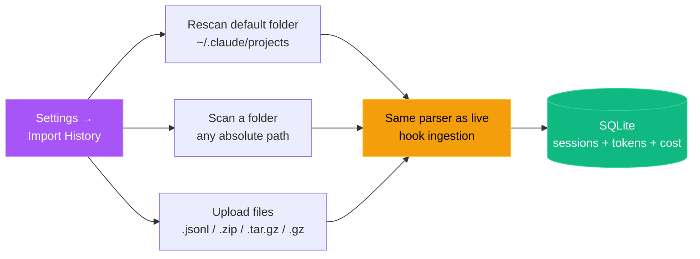
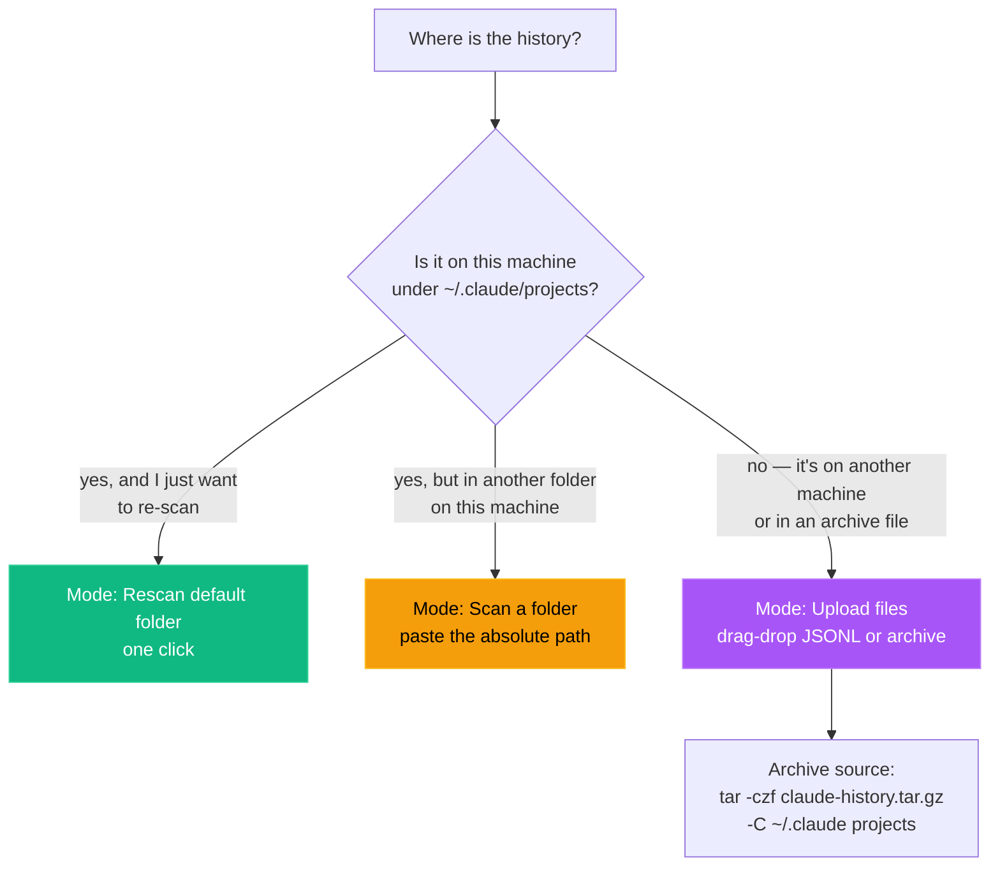
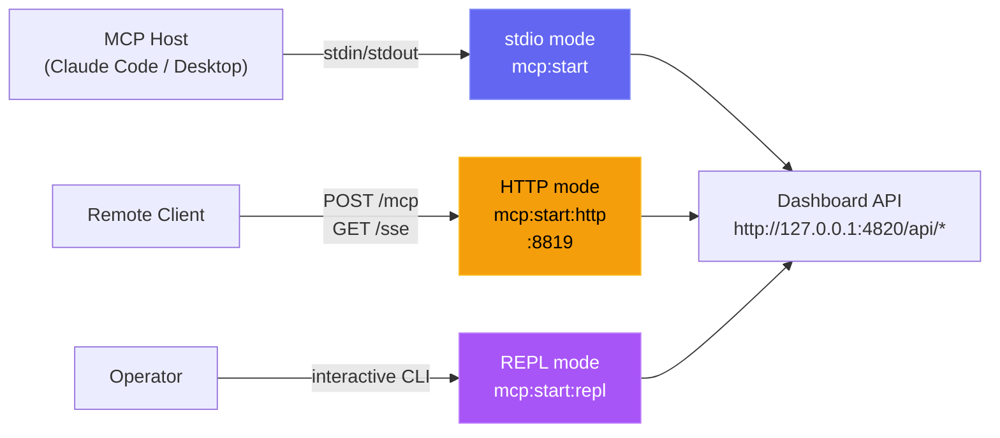
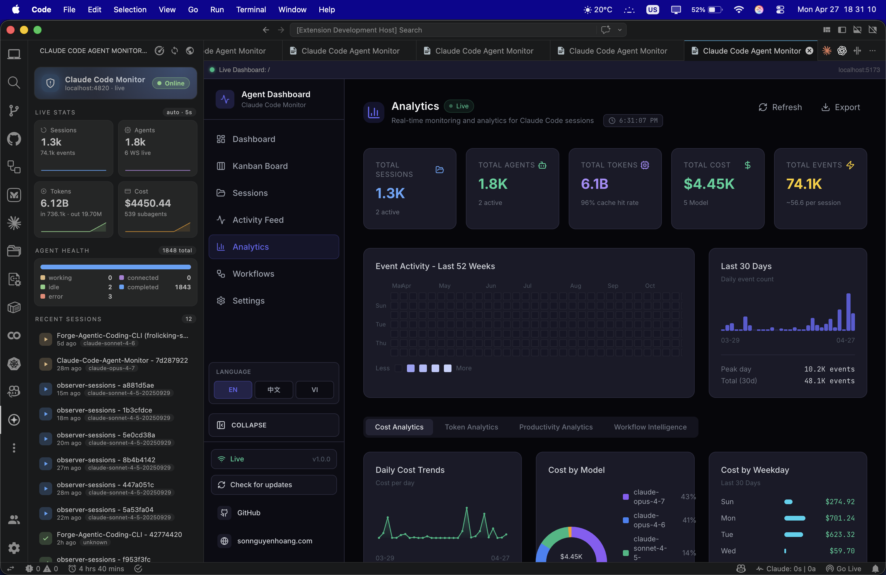
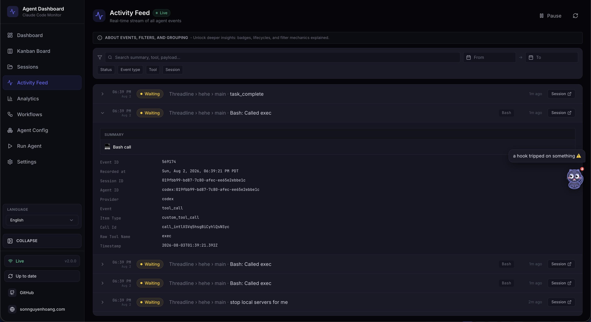

# Installation & Setup

A step-by-step guide to get the Code Agent Monitor up and running on your
machine — install, first run, configuration, deployment surfaces (desktop, VS
Code, container, MCP), and troubleshooting.

## Requirements

| Requirement | Version                     | Notes                                 |
| ----------- | ---------------------------- | -------------------------------------- |
| Node.js     | 22.22+ (24 LTS recommended) | Required for server and client builds |
| npm         | 9+                           | Comes with Node.js                    |
| Claude Code | 2.x+                         | Required for hook integration         |
| Python      | 3.6+                         | Optional — statusline utility only    |
| Git         | Any                           | For cloning the repository            |

---

## Step 1 — Clone the repository

```bash
git clone https://github.com/buluma/Code-Agent-Monitor.git
cd Code-Agent-Monitor
```

---

## Step 2 — Install dependencies

```bash
npm run setup
```

This installs all server and client dependencies, plus the VS Code extension,
and links the `cam` CLI.

A plain root install already covers server **and** client — a `postinstall` hook
installs the client dependencies automatically, so this alone is enough to build
and run the dashboard:

```bash
npm install
```

`npm run setup` additionally installs the VS Code extension, installs and builds
the MCP package, and links the `cam` CLI. The bundled Claude/Codex plugins use
`cam mcp stdio`, so the MCP build is part of normal setup. If you install with
`--ignore-scripts`, the `postinstall` hook is skipped. Run
`cd client && npm install` manually in that case.

Or via Makefile (also installs MCP dependencies):

```bash
make setup
```

---

## Step 3 — Start the dashboard

```bash
npm run dev
```

This starts two processes concurrently:

| Process         | URL                   | Description             |
| --------------- | --------------------- | ------------------------ |
| Express server  | http://localhost:4820 | API, WebSocket, SQLite  |
| Vite dev server | http://localhost:5173 | React frontend with HMR |

Open **http://localhost:5173** in your browser.

> [!TIP]
> When you run the dashboard directly on the host with `npm run dev` or
> `npm start`, the server automatically writes the Claude Code hook
> configuration to `~/.claude/settings.json`. If you run the dashboard in Docker
> or Podman, install hooks from the host with `npm run install-hooks` after the
> container is up.

---

## How it works

Code Agent Monitor integrates with Claude Code through its native hook system.
When Claude Code performs any action (session start, tool use, turn completion,
subagent finish, session exit), it fires a hook that calls a small Node.js
script bundled with this project. That script forwards the event over HTTP to
the dashboard server, which stores it in SQLite and broadcasts it to the browser
over WebSocket.

```
Claude Code  →  hook fires  →  hook-handler.js  →  POST /api/hooks/event
                                                         ↓
Browser  ←  WebSocket broadcast  ←  Express server  ←  SQLite
```

No extra Claude Code configuration is required in the normal host-run path —
when you start the dashboard with `npm run dev` or `npm start`, the server
configures the hooks automatically on startup. Container deployments are the
exception: after the container is up, run `npm run install-hooks` on the host so
Claude Code points at `http://localhost:4820`.

---

## Step 4 — Start a Claude Code session

Start a new Claude Code session from any directory **after** the dashboard
server is running. The hooks will fire automatically and your sessions, agents,
and events will appear in real-time.

```bash
# In a separate terminal, from any project directory:
claude
```

---

## Verification

After starting a Claude Code session, you should see:

- **Sessions page** — your session listed with status `Waiting` (a fresh CLI
  sitting at the prompt) or `Active` (mid-turn)
- **Agent Board** — a `Main Agent` card in the `Waiting` column until you type
  your first message; it flips to `Working` on `UserPromptSubmit` / `PreToolUse`
  and back to `Waiting` after each `Stop`
- **Activity Feed** — events streaming in as Claude Code uses tools
- **Dashboard** — stats updating in real-time
- **Settings page** — model pricing rules, hook configuration status, data
  export and cleanup tools

If nothing appears after 30 seconds, see [Troubleshooting](#troubleshooting) —
specifically [No sessions appearing after starting Claude Code](#no-sessions-appearing-after-starting-claude-code).

### PWA install (optional)

The dashboard is a Progressive Web App. After opening it in a supported browser
(Chrome, Edge, Firefox), you can install it to your dock / home screen:

1. Look for the **install icon** (⊕) in the browser address bar, or open the
   browser menu → "Install app"
2. Once installed, the dashboard launches in its own window with no browser
   chrome
3. Offline support: previously visited pages and assets are served from the
   Service Worker cache when the network is unavailable

The landing page and wiki are also installable PWAs with their own manifests and
service workers — visit each in a browser to install independently.

**Customising the manifest:** Edit the `manifest.json` in the relevant directory
(`client/public/` for dashboard, root for landing, `wiki/` for wiki). Common
fields to change:

- `name` / `short_name` — displayed on the home screen / dock
- `theme_color` — address bar / title bar tint (default: `#6366f1`)
- `background_color` — splash screen background
- `start_url` — entry point when launched from home screen

**Updating the service worker cache:** Each SW has a `CACHE_NAME` constant (e.g.
`dashboard-v2`). After deploying new assets, bump the version string to force
browsers to re-fetch — though for the dashboard this is rarely needed: hashed
`/assets/*` URLs are immutable per build, everything else is fetched
network-first with cache fallback, and a `controllerchange` listener in the
client reloads the page exactly once when a new SW takes over, so a rebuild
propagates without a hard refresh.

**Browser support:** PWA install prompts appear in Chrome 107+, Edge 107+, and
Firefox 110+ (desktop and Android). Safari supports
`apple-mobile-web-app-capable` for iOS home-screen mode but does not show an
install banner.

**Verifying PWA status:** Open DevTools → Application → Manifest to confirm the
manifest loads. Check the Service Workers section to verify the SW is registered
and active. The Lighthouse PWA audit should pass all core checks.

---

## Production mode

To run as a single process serving the built client:

```bash
npm run build   # Build the React client
npm start       # Start Express serving client/dist on port 4820
```

Open **http://localhost:4820** in your browser.

---

## Configuration

### Hook auto-installation

When the dashboard is running directly on the host, the server writes the
following to `~/.claude/settings.json` every time it starts:

```json
{
  "hooks": {
    "SessionStart": [
      {
        "hooks": [
          {
            "type": "command",
            "command": "node \"/path/to/scripts/hook-handler.js\" SessionStart"
          }
        ]
      }
    ],
    "PreToolUse": [
      {
        "matcher": "*",
        "hooks": [
          {
            "type": "command",
            "command": "node \"/path/to/scripts/hook-handler.js\" PreToolUse"
          }
        ]
      }
    ],
    "PostToolUse": [
      {
        "matcher": "*",
        "hooks": [
          {
            "type": "command",
            "command": "node \"/path/to/scripts/hook-handler.js\" PostToolUse"
          }
        ]
      }
    ],
    "Stop": [
      {
        "matcher": "*",
        "hooks": [
          {
            "type": "command",
            "command": "node \"/path/to/scripts/hook-handler.js\" Stop"
          }
        ]
      }
    ],
    "SubagentStop": [
      {
        "matcher": "*",
        "hooks": [
          {
            "type": "command",
            "command": "node \"/path/to/scripts/hook-handler.js\" SubagentStop"
          }
        ]
      }
    ],
    "Notification": [
      {
        "matcher": "*",
        "hooks": [
          {
            "type": "command",
            "command": "node \"/path/to/scripts/hook-handler.js\" Notification"
          }
        ]
      }
    ],
    "SessionEnd": [
      {
        "hooks": [
          {
            "type": "command",
            "command": "node \"/path/to/scripts/hook-handler.js\" SessionEnd"
          }
        ]
      }
    ]
  }
}
```

> [!NOTE]
> Note: `SessionStart` and `SessionEnd` hooks do not support the `matcher` field
> — they fire unconditionally on every session start and exit.

Existing hooks in that file are preserved. The dashboard only adds or updates
entries that contain `hook-handler.js`.

To re-run hook installation manually:

```bash
npm run install-hooks
```

> [!TIP]
> Container note: do not rely on hook auto-install from inside Docker or Podman.
> The hook path written by a container would point at the container filesystem,
> not the host. Start the container first, then run `npm run install-hooks` on
> the host. As a safeguard (issue #193), the installer now **detects container
> execution and refuses to run** (exiting non-zero) so it can never poison a
> bind-mounted host `~/.claude`; the containerized server logs the same guidance
> instead of silently writing a bad path. If you genuinely run Claude Code
> inside the same container, override with
> `CAM_ALLOW_CONTAINER_HOOKS=1 npm run install-hooks`.

> [!NOTE]
> Prefer a ready-made dev environment? This repo ships an **optional** Dev
> Container (`.devcontainer/`) for VS Code / GitHub Codespaces — Node 24 LTS,
> native build tools for `better-sqlite3`, Python, and ports `4820`/`5173`
> preconfigured. It's purely opt-in and changes nothing for host-based
> development. See [`.devcontainer/README.md`](.devcontainer/README.md). (Hooks
> remain host-side there too.)

### Environment variables

| Variable                         | Default                 | Description                                                                                                                                                    |
| --------------------------------- | ------------------------ | ---------------------------------------------------------------------------------------------------------------------------------------------------------------- |
| `DASHBOARD_PORT`                  | `4820`                   | Port the Express server listens on                                                                                                                                |
| `CLAUDE_DASHBOARD_PORT`           | `4820`                   | Port the hook handler uses when posting events to the dashboard                                                                                                   |
| `DASHBOARD_DB_PATH`               | `data/dashboard.db`      | Path to the SQLite database file                                                                                                                                  |
| `NODE_ENV`                        | `development`            | Set to `production` to serve built client                                                                                                                         |
| `CAM_IMPORT_MAX_BYTES`           | `1073741824` (1 GB)      | Maximum size per uploaded file on `/api/import/upload`                                                                                                            |
| `CAM_IMPORT_MAX_FILES`           | `2000`                   | Maximum number of files per upload request                                                                                                                       |
| `CAM_IMPORT_MAX_EXTRACT_BYTES`   | `4294967296` (4 GB)      | Maximum uncompressed bytes any single archive is allowed to expand to (zip-bomb defense)                                                                          |
| `MCP_DASHBOARD_BASE_URL`          | `http://127.0.0.1:4820`  | Base URL used by the local MCP server to call dashboard APIs                                                                                                      |
| `MCP_DASHBOARD_ALLOW_MUTATIONS`   | `false`                  | Enables mutating MCP tools                                                                                                                                        |
| `MCP_DASHBOARD_ALLOW_DESTRUCTIVE` | `false`                  | Enables destructive MCP tools (in addition to mutations)                                                                                                          |
| `MCP_TRANSPORT`                   | `stdio`                  | MCP transport mode: `stdio`, `http`, `repl`                                                                                                                       |
| `MCP_HTTP_PORT`                   | `8819`                   | Port for the MCP HTTP+SSE server (only when `MCP_TRANSPORT=http`)                                                                                                 |
| `MCP_HTTP_HOST`                   | `127.0.0.1`               | Bind address for the MCP HTTP server                                                                                                                              |
| `MCP_HTTP_AUTH_TOKEN` / `_FILE`   | unset                    | Protect MCP `/mcp`, `/sse`, and `/messages`; `/health` stays probeable                                                                                            |
| `MCP_HTTP_SESSION_TIMEOUT_MS`     | `1800000`                | Close an idle MCP HTTP/SSE session after this long with no request; `0` disables reaping. Other values are clamped to `[60000, 86400000]`, and an unparseable value falls back to the default |
| `DASHBOARD_TOKEN_FILE`            | unset                    | File-backed dashboard API/WebSocket token                                                                                                                         |
| `DASHBOARD_HOOK_TOKEN` / `_FILE`  | unset                    | Dedicated credential for remote hook ingestion                                                                                                                    |
| `DASHBOARD_ENV_PATH`              | repo `.env`               | Writable dotenv path for persisted Settings overrides                                                                                                             |
| `CAM_DASHBOARD_URL`              | localhost discovery      | Remote hook destination; non-loopback requires HTTPS and hook auth                                                                                                |
| `CAM_HOOK_TOKEN` / `_FILE`       | unset                    | Credential sent by Claude/Codex hook handlers                                                                                                                     |

Example with a custom port:

```bash
DASHBOARD_PORT=9000 npm run dev
```

> [!NOTE]
> You usually do **not** need to set `DASHBOARD_PORT` manually. `npm run dev` is
> wrapped by `scripts/dev.js`, which probes both `127.0.0.1` and `::1` (so an
> SSH `LocalForward` bound to one loopback can't slip past) and picks the first
> free port in `4820–4859` automatically. The chosen port is propagated to the
> Vite dev proxy via `DASHBOARD_PORT`, and the Express server writes it to
> `~/.claude/.agent-dashboard.json` so the Claude Code hook handler discovers it
> without any env var.
>
> Multiple dashboards can run side by side — for example `npm run dev` and the
> desktop app (macOS) at the same time. Each one appends its
> `{port, pid, startedAt}` entry to the discovery file, and
> `scripts/hook-handler.js` fan-outs every hook event to every live entry, so
> both UIs keep their real-time stream.
>
> Setting `CLAUDE_DASHBOARD_PORT=N` overrides discovery entirely and forces the
> hook handler to a single port — useful for tests and container setups where
> the in-process discovery file isn't reachable from the host.
>
> If you bypass the picker (e.g. `npm run dev:raw`, container builds, or
> anything else that calls `node server/index.js` directly), make sure your
> client is built / proxied against the port the server actually bound.

Every env var also belongs in `.env.example` with a sane default and comment —
that file is the source checked for drift, this table is the human-readable
mirror.

### Advanced tuning and security variables

| Environment Variable                                 | Default                          | Description                                                                                                                                                                                                                                                                                                                                                                                                                                                                                                                                                                                       |
| ---------------------------------------------------- | --------------------------------- | -------------------------------------------------------------------------------------------------------------------------------------------------------------------------------------------------------------------------------------------------------------------------------------------------------------------------------------------------------------------------------------------------------------------------------------------------------------------------------------------------------------------------------------------------------------------------------------------------- |
| `DASHBOARD_UPDATE_CHECK`                             | _(enabled)_                      | Set to `0` / `false` / `off` to disable periodic git upstream checks                                                                                                                                                                                                                                                                                                                                                                                                                                                                                                                              |
| `DASHBOARD_UPDATE_CHECK_INTERVAL_MS`                 | `300000` (5 min)                 | Interval between automatic checks; floor 60 000 ms. Users can also click **Check now** in the update modal or in the sidebar to run one on demand.                                                                                                                                                                                                                                                                                                                                                                                                                                                |
| `DASHBOARD_STALE_MINUTES`                            | `180` (3 h)                      | Minutes of inactivity before a still-`active` session (including one sitting in **Waiting** on user input — "Waiting" is a UI overlay on an `active` row, not a stored status) is auto-marked **abandoned** and drops off the active list. Enforced by the 15 s watchdog and the periodic maintenance sweep (which runs every ¼ of this value, clamped to 60 s – 5 min). Lower it (e.g. `60`) for a shorter idle timeout                                                                                                                                                                          |
| `DASHBOARD_WORKING_IDLE_SECONDS`                     | `120`                            | Idle-working timeout for recovering a turn cancelled with `Esc` **before any output** (which leaves no transcript marker). When the main agent has been `working` with no tool in flight and neither a hook event nor the transcript has advanced for this long, the watchdog moves the session to **Waiting**. Lower it for snappier recovery at the cost of occasional false flips on long silent-thinking turns (which self-heal)                                                                                                                                                              |
| `DASHBOARD_LIVENESS_PROBE`                           | `1` (on)                         | Set to `0` to disable the watchdog's **dead-session liveness reap** (the `ps`/`lsof`-based probe that completes `active` local Claude Code or Codex sessions whose matching CLI process no longer exists — recovering a `SessionEnd` lost while the dashboard was down). Sessions forwarded from **another machine** (household hooks) report a non-POSIX `cwd` and are auto-skipped by the reap, so a mixed local + forwarded deployment no longer needs this off; disable it only for a purely-remote setup where local processes prove nothing. Auto-disabled on Windows and inside containers |
| `DASHBOARD_LIVENESS_IDLE_SECONDS`                    | `60`                             | Idle gate for the **watchdog-tick** liveness reap: a session is only completed when its transcript hasn't been written for at least this long (the last hook write is the fallback clock when no transcript exists on disk), so a mid-turn or just-resumed session never flickers out on a transient probe miss. The startup passes ignore this gate — at boot the probe alone decides, so sessions quit moments before launch clear immediately                                                                                                                                                  |
| `DASHBOARD_SESSION_SYNC_MS`                          | `30000`                          | Poll interval (ms) for the continuous `~/.claude/projects` background sync that surfaces projects added after startup whose sessions never flow through hooks. The `fs.watch` watcher fires near-instantly regardless; this poll is the safety net (watchers can miss events / not fire on network filesystems). Set to `0` to disable the poll while leaving the watcher running                                                                                                                                                                                                                 |
| `DASHBOARD_CODEX_HOME`                               | `CODEX_HOME` or `~/.codex`       | Optional local Codex state directory. Rollouts are read only from its `sessions/` tree; saving a new location in Settings persists this dashboard-only override, re-arms live watching, and immediately scans the new tree.                                                                                                                                                                                                                                                                                                                                                                       |
| `DASHBOARD_CODEX_SYNC_MS`                            | `4000`                           | Safety-net poll interval (ms) for append-only Codex rollouts. Codex hooks trigger the same incremental ingest immediately; set to `0` to disable only the poll while retaining the filesystem watcher when available.                                                                                                                                                                                                                                                                                                                                                                             |
| `DASHBOARD_HELMCODE_HOME`                            | `HELMCODE_HOME` or `~/.helmcode` | Optional local Helm Code state directory. Its `userdata/state.sqlite` threads are mirrored read-only into the dashboard; saving a new location in Settings persists this dashboard-only override, re-arms live monitoring, and immediately scans the new tree. Deleted/archived threads are wiped from the dashboard.                                                                                                                                                                                                                                                                             |
| `DASHBOARD_HELMCODE_SYNC_MS`                         | `4000`                           | Safety-net poll interval (ms) for the Helm Code state database. The `fs.watch` watcher on `state.sqlite`/`state.sqlite-wal` triggers the same incremental ingest immediately; set to `0` to disable only the poll while retaining the watcher when available.                                                                                                                                                                                                                                                                                                                                     |
| `DASHBOARD_TASK_SUMMARY_TTL_MS`                      | `2000`                           | Serve-stale window (ms) for the per-transcript task-progress cache behind `include_task_progress` list requests **and** the session-detail `todo_snapshot`. A transcript being actively appended to rarely hits the size+mtime cache key, so without this floor a burst of list reloads (e.g. the dashboard refreshing on hook-driven WebSocket events) re-parses a multi-MB live transcript once per request. Within the window a just-parsed (slightly stale, display-only) result is returned instead; set to `0` to restore immediate re-parse on every change                                |
| `DASHBOARD_REMOTE_SYNC_MS`                           | `15000` (15 s)                   | Poll interval (ms) for the **Remote Data Sources** background sync that independently pulls each enabled remote's `~/.claude/projects` and `~/.codex/sessions` (plus Codex's lightweight `session_index.jsonl` title index) over SSH, then re-imports each through its local importer. New/enabled sources also sync immediately. Set to `0` to disable the poller (manual / on-demand syncs still work)                                                                                                                                                                                          |
| `DASHBOARD_REMOTE_ACTIVE_WINDOW_MS`                  | `600000` (10 min)                | Freshness window for a **Remote Data Source** session's live status. On each sync, a remote Claude Code or Codex session whose matching mirrored transcript has a **last JSONL event** within this window is treated as still running (`active`); once the mirror stops advancing for longer than this, the session is reconciled to `completed`. Remote sessions receive no live hooks, so provider-aware mirror reconciliation replaces local liveness; failed, unavailable, or stuck provider mirrors fall back to the normal stale sweep. Raise it for slow links or very long idle turns     |
| `DASHBOARD_REMOTE_SYNC_TIMEOUT_MS`                   | `600000` (10 min)                | Per-source timeout (ms) for a single remote sync (`scp` pull + import) before it is aborted                                                                                                                                                                                                                                                                                                                                                                                                                                                                                                       |
| `DASHBOARD_REMOTE_TEST_TIMEOUT_MS`                   | `15000` (15 s)                   | Timeout (ms) for the **Test** SSH probe (`POST /api/remote-sources/:id/test`) that verifies a remote source is reachable                                                                                                                                                                                                                                                                                                                                                                                                                                                                          |
| `DASHBOARD_HOST`                                     | `127.0.0.1`                      | Interface the server binds to. Loopback by default (not network-reachable). Set to `0.0.0.0` to expose on a LAN (logs a startup warning)                                                                                                                                                                                                                                                                                                                                                                                                                                                          |
| `DASHBOARD_TOKEN`                                    | _(unset)_                        | When set, every `/api/*` request and the WebSocket must present the token (`Authorization: Bearer <token>`, `x-dashboard-token` header, or `?token=`). Off by default — loopback bind is the trust boundary                                                                                                                                                                                                                                                                                                                                                                                       |
| `DASHBOARD_ALLOWED_HOSTS`                            | _(loopback)_                     | Comma-separated extra `Host` values allowed on HTTP + WebSocket upgrades (DNS-rebinding guard). Add your LAN hostnames here when binding beyond loopback                                                                                                                                                                                                                                                                                                                                                                                                                                          |

> [!IMPORTANT]
> **Secure by default.** The server binds `127.0.0.1` and is **not** reachable
> from the network out of the box
> ([GHSA-gr74-4xfh-6jw9](./.github/SECURITY.md)). To expose it on a LAN, set
> **both** `DASHBOARD_HOST` (e.g. `0.0.0.0`) **and** `DASHBOARD_TOKEN` (which
> then gates `/api/*` and the WebSocket), and list your LAN hostnames in
> `DASHBOARD_ALLOWED_HOSTS`. See [`.env.example`](./.env.example) and
> [`.github/SECURITY.md`](./.github/SECURITY.md) for details.

For git clones, the server periodically `git fetch`es `origin` and compares your
checkout to `origin/master`, `origin/main`, or `origin/HEAD`. When you are
behind, a message appears in the server terminal and a modal appears in the UI
with the exact command to run. The dashboard never pulls or restarts itself —
you copy the command, run it in a terminal, then restart the server the same way
you started it.

---

## Step 5 — (Optional) Import existing Claude Code history

The server **automatically imports** every session under `~/.claude/projects/`
on startup, so if you've used Claude Code on this machine before, your
historical sessions, agents, events, token counts, and cost totals should
already be visible in the Sessions list.

To bring in history from another machine, a backup, or a `.tar.gz` archive a
teammate sent you, use **Settings → Import History** in the UI. It supports
three modes:



Re-imports are idempotent: sessions are deduplicated by UUID and compaction
baselines preserve pre-compaction token totals, so running the importer twice
never double-counts tokens or cost.

Verify it worked by opening the **Analytics** page and checking that per-model
token totals and estimated cost look correct.

<p align="center">
  
</p>

### Pick the right mode



### Step-by-step: moving history from one machine to another

**On the source machine**, bundle the projects folder:

```bash
# macOS / Linux
tar -czf claude-history.tar.gz -C ~/.claude projects

# Windows (PowerShell, via built-in tar)
tar -czf claude-history.tar.gz -C "$env:USERPROFILE\.claude" projects
```

Transfer the resulting `claude-history.tar.gz` to the destination machine
however you like — AirDrop, `scp`, USB, cloud storage.

**On the destination machine**, in the dashboard:

1. Open **Settings → Import History**.
2. Pick **Upload files** (the third tab).
3. Drag the archive onto the drop zone.
4. Click **Upload & Import** and watch the progress.
5. When the green result card appears, open **Analytics → Cost** to confirm
   per-model token totals and estimated cost.

### Supported inputs

Any of the following can be dropped onto the upload zone or found inside a
folder given to **Scan a folder**:

- `.jsonl` — session transcripts
- `.meta.json` — subagent metadata sidecars
- `.zip` — extracted with path-traversal protection
- `.tar`, `.tar.gz`, `.tgz` — extracted via the `tar` package
- `.gz` — single gzipped JSONL (streaming-decompressed)

### Accuracy guarantees

- **Idempotent** — re-importing never double-counts. Sessions are deduplicated
  by UUID.
- **Cost-preserving** — the `token_usage` table uses `baseline_*` columns to
  preserve pre-compaction token totals, so re-ingesting a compacted transcript
  never erases historical cost.
- **Same parser as live** — `parseSessionFile` + `importSession` is the single
  source of truth for both hook-driven ingestion and manual import, so imported
  numbers match captured numbers exactly.

### Safety

Archive extraction is hardened against path traversal and archive bombs. The
defaults are generous for real-world transcripts but tight enough to stop
obvious attacks — see [Environment variables](#environment-variables) above for
`CAM_IMPORT_MAX_BYTES`, `CAM_IMPORT_MAX_FILES`, and
`CAM_IMPORT_MAX_EXTRACT_BYTES`.

### CLI alternative

For scripts and automation, the same logic runs from the terminal:

```bash
# Import (or re-import) everything under ~/.claude/projects
npm run import-history

# Dry run — show what would be imported without writing
node scripts/import-history.js --dry-run

# Scope to a single project dir
node scripts/import-history.js --project my-project

# Refresh token totals for imported sessions (high-water mark: never lowers a total)
npm run reconcile-tokens

# One-time repair for token totals inflated by the pre-v2.0.9 per-record usage sum.
# Re-derives every CLAUDE session that still has a transcript on disk and zeroes
# the compaction baselines, so corrected (lower) totals actually stick.
# Stop the dashboard first — live hook ingestion races the repair, and the
# command refuses to run while a dashboard answers on a known port.
npm run repair-tokens
```

`--reconcile-tokens` accepts two flags: `--all` widens the sweep from
already-imported sessions to every **Claude** session with a transcript on disk
(live-ingested sessions carry no `imported` marker), and `--reset-baselines`
writes the re-derived totals as the whole truth instead of folding a decrease
into the `baseline_*` high-water columns. `npm run repair-tokens` is the two
together. `--dry-run` is rejected rather than ignored, since the sweep writes
inside a transaction.

Scope, precisely:

- A session's transcript is found by scanning `~/.claude/projects/` for the
  default `<proj>/<sid>.jsonl` layout, then by the `transcript_path` stored on
  the session row — so a session imported from a custom directory via
  `cam import path` is covered too.
- Only **non-workflow** rows are rewritten. Workflow rows
  (`service_tier = 'workflow'`) come from run journals, not transcripts, and
  are preserved.
- **Codex sessions are skipped entirely.** Their usage comes from rollout
  journals rather than Claude transcripts, so the sweep must not rebuild — or
  clear — their rows.
- Sessions whose transcript has been deleted, or whose stored path is stale, are
  skipped and reported as `missingFiles`: their totals cannot be re-derived, so
  they keep whatever was recorded.

---

## Desktop App (macOS) (optional)

If you'd rather not keep a terminal window open, the project also ships an
Electron 35-based **native desktop app** (the `desktop/` workspace), available
for **macOS**. It embeds the Express server in-process, renders the built React
client in a `BrowserWindow`, registers a menu-bar / notification-area (tray)
icon, and offers a one-click "Open at Login" toggle. Everything you'd see in the
browser at `localhost:4820` lives inside a single app you install once —
distributed as a macOS `.app` (in a `.dmg`).

### Prerequisites

| For…                                      | You need                                                                                                                                                                                 |
| ------------------------------------------- | -------------------------------------------------------------------------------------------------------------------------------------------------------------------------------------------- |
| Downloading a pre-built installer (macOS) | macOS — nothing else                                                                                                                                                                     |
| Building the DMG locally (macOS)          | macOS, Node.js 22.22+ (24 LTS recommended), npm 10+, and **Xcode command-line tools** (`xcode-select --install`) so the native `better-sqlite3` module can be rebuilt for Electron's ABI |

### Way 1 — Download a pre-built installer

The fastest path. There are two flavours:

**1a. From the latest GitHub Release** _(recommended — public, no sign-in)_

Open
[**Releases → latest**](https://github.com/buluma/Code-Agent-Monitor/releases/latest)
and download the asset for your platform. CI publishes a new `vX.Y.Z` release
automatically every time the version in `package.json` is bumped on `master`, so
this link always points at the current shipping build.

| Platform              | Asset                               | Notes                     |
| ----------------------- | -------------------------------------- | --------------------------- |
| macOS (Apple Silicon) | `ClaudeCodeMonitor-<ver>-arm64.dmg` | drag into `/Applications` |
| macOS (Intel)         | `ClaudeCodeMonitor-<ver>-x64.dmg`   | drag into `/Applications` |

**1b. From the per-commit CI artifact** _(useful for testing master before it's
tagged — sign-in required, 14-day retention)_

Every green run of the desktop CI job uploads a packaged artifact —
`ClaudeCodeMonitor-dmg` from the `🍎 macOS Desktop (DMG)` job:

- **Via the GitHub UI:** open the latest passing run under
  [Actions](https://github.com/buluma/Code-Agent-Monitor/actions/workflows/ci.yml?query=branch%3Amaster+is%3Asuccess),
  scroll to **Artifacts**, and download `ClaudeCodeMonitor-dmg`.
- **Via the `gh` CLI:**

  ```bash
  gh run download <run-id> -R buluma/Code-Agent-Monitor -n ClaudeCodeMonitor-dmg   # macOS
  ```

  Unzip the artifact to get the `.dmg`s.

Then jump to [Install the app](#install-the-app).

### Way 2 — Build the installer locally

From the project root, after `git clone`. electron-builder packages for the
**host OS**, so build the macOS DMG on a Mac. The common prelude is the same:

```bash
npm run setup                # install root + client + vscode-extension + MCP deps, build MCP, link cam
npm run build                # build the React client (the SPA the window loads)
npm run desktop:install      # install Electron + electron-builder into desktop/

# macOS (run on macOS):
npm run desktop:dmg:arm64    # fast single-arch DMG → desktop/release/
```

The artifact lands in `desktop/release/`. Pick the build command that matches
your goal:

| Command                          | Platform / Architecture                            | Speed          | Use when                                                                                                                            |
| ---------------------------------- | ---------------------------------------------------- | ---------------- | ---------------------------------------------------------------------------------------------------------------------------------------- |
| `npm run desktop:dmg`            | macOS — both per-arch DMGs (arm64 + x64)           | **Slower**     | Building the release DMGs for everyone                                                                                                |
| `npm run desktop:dmg:arm64`      | macOS — Apple Silicon only                          | Fast (~1 min)  | Building for your own Apple Silicon Mac                                                                                                |
| `npm run desktop:dmg:x64`        | macOS — Intel only                                  | Fast (~1 min)  | Building for your own Intel Mac                                                                                                        |
| `npm run desktop:dmg:universal`  | macOS — one merged universal DMG (arm64 + x86_64) | **Slowest**    | Hand-distributing a single file that runs on any Mac (not what the release ships)                                                      |
| `npm run desktop:install`        | —                                                    | —               | Install Electron + electron-builder deps; preflights the native `better-sqlite3` build and prints actionable setup help on failure |
| `npm run desktop:build`          | —                                                    | —               | TypeScript compile only (`out/`)                                                                                                        |
| `npm run desktop:dev`            | —                                                    | —               | Build, then launch Electron locally                                                                                                    |
| `npm run desktop:test`           | —                                                    | —               | Smoke test (spawn Electron, probe `/api/health`)                                                                                       |

> [!IMPORTANT]
> **DMGs build on macOS** — electron-builder packages for the host OS. On macOS,
> `npm run desktop:dmg` builds the app **twice** (one tree per architecture) and
> emits **both** per-arch DMGs (`arm64` + `x64`) — the release build. It does
> **not** merge them into a single universal binary; the two DMGs are what ship.
> **When building for your own Mac, use `desktop:dmg:arm64` or
> `desktop:dmg:x64`** — a single architecture finishes in roughly a minute. CI
> already builds both DMGs for you (see Way 1).
>
> Every `desktop:dmg*` script chains `npm run build` first. Running
> `electron-builder` bare skips the TypeScript compile and fails with
> `entry file out/main.js does not exist`. `npm run clean` inside `desktop/`
> deletes `out/` and `release/` — after a clean you must `npm run desktop:build`
> again before packaging.
>
> On macOS, building a DMG rebuilds the native `better-sqlite3` module for the
> **target** architecture, which can leave it built for the wrong CPU arch for
> your local machine. The desktop `prebuild` step auto-heals this — it rebuilds
> `better-sqlite3` for the local machine on the next `desktop:build` — so
> `npm run desktop:dev` and `npm run desktop:test` keep working after a
> cross-arch DMG build with no manual `npm run desktop:install` needed.

### Install the app

**macOS.** Each `desktop:dmg*` build wipes `release/` first. `desktop:dmg:arm64`
→ `…-arm64.dmg` and `desktop:dmg:x64` → `…-x64.dmg` each emit a single DMG whose
mounted-volume title states the architecture (e.g. _Claude Code Monitor (Apple
Silicon)_); `desktop:dmg` emits **both** (`…-arm64.dmg` + `…-x64.dmg`) for
release. Install the one matching your Mac: an x64 build on Apple Silicon makes
macOS prompt for Rosetta.

```bash
open desktop/release/ClaudeCodeMonitor-*-arm64.dmg   # the arch you built
```

1. The DMG mounts — drag **Claude Code Monitor** into your `Applications`
   folder.
2. The DMG is ad-hoc signed, so macOS Gatekeeper shows a warning (_"Apple could
   not verify…"_) on first launch. Strip the quarantine attribute, then open it:

   ```bash
   xattr -cr "/Applications/Claude Code Monitor.app"
   open "/Applications/Claude Code Monitor.app"
   ```

   Alternatively, open → _System Settings → Privacy & Security_ and click _Open
   Anyway_. Real Developer ID signing and notarization are opt-in via the
   `CSC_LINK` / `CSC_KEY_PASSWORD` and `APPLE_ID` / `APPLE_TEAM_ID` /
   `APPLE_APP_SPECIFIC_PASSWORD` repository secrets — see
   [`DESKTOP.md`](DESKTOP.md#notarization-for-the-maintainer).

Once running, the embedded server boots on port `4820` (or adopts an
already-healthy server on `4820`, or falls back to `4821`–`4829` / a random high
port), the menu-bar / notification-area (tray) icon appears, and the dashboard
window opens. **Hooks are installed automatically on first boot** — an
install-only user does not need `npm run install-hooks`; just start a new Claude
Code session. Closing the window hides it but keeps the server running; **Quit**
from the tray exits.

> [!NOTE]
> The packaged app stores its SQLite database and VAPID keys in a per-user
> app-data directory **outside** the app bundle / install dir —
> `~/Library/Application Support/Claude Code Monitor/data/`. Your imported
> history and events therefore **survive app reinstalls and updates**. (Older
> macOS builds kept the database inside the bundle, which is read-only once
> installed and code-signed — that broke History Import; it is now fixed. If you
> are upgrading from a pre-fix build, there is a one-time data gap: re-run
> **Settings → Import History → Rescan** once.)

### Desktop runtime behavior

**Port-adoption behavior.** When the desktop app launches, its embedded server
picks a port:

1. It prefers **`4820`**.
2. If a healthy dashboard server already answers `GET /api/health` on `4820`
   (for example you ran `npm start` in a terminal), the app **adopts that
   server** instead of double-binding — no SQLite contention. An adopted server
   is _not_ owned by the app, so quitting the app leaves it running.
3. Otherwise it falls back to `4821`–`4829`, then to a random high port
   (`49152`–`49500`).

The chosen port is shown in the tray menu. The embedded server also honors the
dashboard env vars in [Environment variables](#environment-variables)
(`DASHBOARD_PORT` is set automatically by the desktop host).

**`claude` CLI resolution.** A Finder/Dock-launched macOS app inherits only
launchd's minimal `PATH`, not your login-shell `PATH`. So the app can find and
spawn the `claude` CLI for the "Run Claude" feature, the desktop host recovers
your login-shell `PATH` at startup. If "Run Claude" still reports that `claude`
is not on `PATH`, make sure `claude` is a real executable on your shell `PATH` —
a shell alias or function cannot be spawned.

**Auto-start at login.** Toggle _Open at Login_ from the tray menu or the
application menu. It registers via the first-party `SMAppService` API
(Electron's `app.setLoginItemSettings`), so the entry appears under → _System
Settings → General → Login Items_. When the app is launched at login, it starts
**tray-only** — the dashboard window stays hidden until you click the tray icon.

**Logs.** The Electron main process has no terminal when launched from Finder,
so it writes to a per-user log file:

```
~/Library/Logs/Claude Code Monitor/desktop.log     # macOS
```

Open it from the tray menu → **Show Logs**. Set `CAM_DESKTOP_VERBOSE=1` to also
mirror `info`/`warn` lines to stdout when running via `npm run desktop:dev`.

**Lifecycle reminder.** Closing the dashboard window only **hides** it — the
server and tray keep running. **Quit** (⌘Q or tray → _Quit_) shuts the embedded
server down gracefully and exits. Double-launching just focuses the existing
window (single-instance lock); it never starts a second server.

Full user guide: [`DESKTOP.md`](DESKTOP.md). Contributor / architecture
reference: [`desktop/README.md`](desktop/README.md).

---

## Optional: Local MCP server

If you want AI agents to call dashboard functionality through MCP tools, run the
local MCP server in `mcp/`:

```bash
npm run mcp:install
npm run mcp:build
npm run mcp:start              # stdio (for MCP host integration)
npm run mcp:start:http         # HTTP + SSE server on port 8819
npm run mcp:start:repl         # interactive CLI with tab completion
```

The MCP server supports three transport modes:



See [mcp/README.md](./mcp/README.md) — the canonical MCP doc — for host config,
tool catalog, and safety flags.

To build the MCP server as a container image instead:

```bash
npm run mcp:docker:build
# or
npm run mcp:podman:build
```

---

## Optional: Agent extension packs

This repository includes extension packs for both Claude Code and Codex.

- Claude Code loads project extensions from:
  - `CLAUDE.md`
  - `.claude/rules/`
  - `.claude/skills/`
  - `.claude/agents/`
- Codex project packs live under `.codex/`:
  - `AGENTS.md`
  - `.codex/config.toml`
  - `.codex/rules/default.rules`
  - `.codex/agents/`
  - `.codex/skills/`
  - `.agents/plugins/marketplace.json`
- Shared plugins:
  - `plugins/*/.claude-plugin/plugin.json`
  - `plugins/*/.codex-plugin/plugin.json`
  - `plugins/*/skills/*/SKILL.md`
  - `plugins/*/skills/*/agents/openai.yaml`

See [`.codex/README.md`](./.codex/README.md) and
[`docs/PLUGINS.md`](./docs/PLUGINS.md) for Codex, Claude, and skills.sh
installation details.

---

## Optional: VS Code extension

The **Code Agent Monitor** is also available as a dedicated VS Code extension
for seamless, integrated monitoring.

<p align="center">
  
</p>

### Features

- **Real-time Sidebar**: Monitor agent status, health, and usage stats in the
  Activity Bar.
- **Pulse Status Bar**: High-level session and agent counts in the bottom status
  bar.
- **Direct Navigation**: Jump to specific dashboard pages or recent sessions.
- **Embedded Dashboard**: Full dashboard interface within a native VS Code tab.
- **Automated Detection**: Automatically finds your dashboard server on ports
  `5173` or `4820` (data requests always target `4820` — see the note under
  [Port 4820 already in use](#port-4820-already-in-use) if you run a custom
  `DASHBOARD_PORT`).

### Installation

1. Open the [vscode-extension](./vscode-extension) folder in VS Code.
2. Install via the Marketplace or package it manually:
   ```bash
   cd vscode-extension
   npm install
   # Generate .vsix for local install
   npm run package
   ```
3. After installation, ensure the main dashboard server is running
   (`npm run dev`).
4. Look for the **Radar icon** in your VS Code Activity Bar.

For advanced configuration, refer to the [.vscode](./.vscode) and
[vscode-extension](./vscode-extension) directories.

> [!TIP]
> Extension on VS Code Marketplace:
> [Code Agent Monitor](https://marketplace.visualstudio.com/items?itemName=buluma.claude-code-agent-monitor)

---

## Container mode (Docker / Podman)

The OCI runtime is non-root, uses Tini as PID 1, includes Git/OpenSSH/SQLite,
and is read-only except for data/config volumes and tmpfs. Docker Compose and
Podman Compose use the same file.

```bash
# Dashboard only
docker compose up -d --build
# or
podman compose up -d --build

# Complete authenticated stack
umask 077
openssl rand -hex 32 > deployments/secrets/dashboard-token
openssl rand -hex 32 > deployments/secrets/hook-token
openssl rand -hex 32 > deployments/secrets/mcp-token
openssl rand -base64 32 > deployments/secrets/grafana-admin-password
npm run docker:full:up
```

Container behavior:

- dashboard `4820`, MCP `8819`, Nginx `8080`, Prometheus `9090`, and Grafana
  `3000` bind host loopback by default
- Claude and Codex homes mount read-only at `/home/node/.claude` and
  `/home/node/.codex`
- named volumes persist `/app/data` and `/app/config` (SQLite and dashboard-owned
  config)
- the root filesystem is read-only, all Linux capabilities are dropped, and
  `no-new-privileges` is enabled
- Git, OpenSSH, and SQLite CLI are installed for updates, Remote Data Sources,
  backup, and restore
- MCP HTTP/SSE requires `mcp-token`; Nginx blocks hooks, metrics, and MCP unless
  an explicit proxy policy is mounted
- host hooks are still installed from the host with `npm run install-hooks`

> [!IMPORTANT]
> Install hooks on the host. For remote cloud hooks, use
> `CAM_DASHBOARD_URL=https://...` and `CAM_HOOK_TOKEN`; non-loopback targets
> require HTTPS. See [`DEPLOYMENT.md`](DEPLOYMENT.md) for Run Agent containers,
> remote hooks, Kubernetes, Terraform, backup, restore, and rollback.

<p align="center">
  
</p>

<p align="center">
  
</p>

<p align="center">
  
</p>

<p align="center">
  
</p>

<p align="center">
  
</p>

<p align="center">
  
</p>

---

## Database

The SQLite database is created automatically at `data/dashboard.db` on first
run. The directory is created if it does not exist. The database uses WAL mode
for concurrent reads and foreign keys for referential integrity.

### Clear all data

To remove all sessions, agents, events, and token usage (useful after running
seed data or for a clean start):

```bash
npm run clear-data
```

### Data management via Settings page

The Settings page (`/settings`) provides a UI for:

- **Model Pricing** — view and edit per-model cost rates, reset to defaults, add
  custom models
- **Hook Configuration** — check which hooks are installed and reinstall them
- **Data Export** — download all sessions, agents, events, and pricing as a JSON
  file
- **Session Cleanup** — abandon stale active sessions after N hours, purge old
  completed sessions after N days
- **Clear All Data** — remove all sessions, agents, events, and token usage
- **Data Management** and **About** sections render with loading placeholders
  while server info is being fetched, so the page is always fully navigable

### Seed demo data

To populate the dashboard with sample sessions, agents, and events for UI
exploration:

```bash
npm run seed
```

---

## Scripts reference

| Script              | Command                     | Description                                                                                                                                                                                                                    |
| --------------------- | ------------------------------ | ---------------------------------------------------------------------------------------------------------------------------------------------------------------------------------------------------------------------------------- |
| `setup`             | `npm run setup`             | Install root, client, VS Code extension, and MCP dependencies, build MCP, and link `cam`                                                                                                                                      |
| `dev`               | `npm run dev`               | Start server + client in development mode                                                                                                                                                                                      |
| `start`             | `npm start`                 | Start server in production mode                                                                                                                                                                                                |
| `build`             | `npm run build`             | Build the React client to `client/dist/`                                                                                                                                                                                       |
| `install-hooks`     | `npm run install-hooks`     | Write Claude Code hooks to `~/.claude/settings.json`                                                                                                                                                                           |
| `clear-data`        | `npm run clear-data`        | Delete all data from the database                                                                                                                                                                                              |
| `seed`              | `npm run seed`               | Insert demo sessions/agents/events                                                                                                                                                                                             |
| `import-history`    | `npm run import-history`    | Import legacy sessions from `~/.claude/` (also runs on startup)                                                                                                                                                                |
| `reconcile-tokens`  | `npm run reconcile-tokens`  | Refresh token totals for imported sessions (never lowers a total)                                                                                                                                                              |
| `repair-tokens`     | `npm run repair-tokens`     | Re-derive non-workflow token totals for every Claude session with a transcript on disk and zero the compaction baselines, preserving workflow and Codex rows (one-time fix for pre-v2.0.9 inflation; stop the dashboard first) |
| `mcp:install`       | `npm run mcp:install`       | Install MCP package dependencies                                                                                                                                                                                               |
| `mcp:build`         | `npm run mcp:build`         | Build MCP server into `mcp/build/`                                                                                                                                                                                             |
| `mcp:start`         | `npm run mcp:start`         | Start MCP server (stdio, for MCP hosts)                                                                                                                                                                                        |
| `mcp:start:http`    | `npm run mcp:start:http`    | Start MCP HTTP+SSE server on port 8819                                                                                                                                                                                         |
| `mcp:start:repl`    | `npm run mcp:start:repl`    | Start interactive MCP REPL                                                                                                                                                                                                     |
| `mcp:dev`           | `npm run mcp:dev`           | Start MCP server in dev mode (stdio)                                                                                                                                                                                           |
| `mcp:dev:http`      | `npm run mcp:dev:http`      | Start MCP HTTP server in dev mode                                                                                                                                                                                              |
| `mcp:dev:repl`      | `npm run mcp:dev:repl`      | Start MCP REPL in dev mode                                                                                                                                                                                                     |
| `mcp:typecheck`     | `npm run mcp:typecheck`     | Type-check MCP source                                                                                                                                                                                                          |
| `mcp:docker:build`  | `npm run mcp:docker:build`  | Build MCP container image with Docker                                                                                                                                                                                          |
| `mcp:podman:build`  | `npm run mcp:podman:build`  | Build MCP container image with Podman                                                                                                                                                                                          |
| `test:mcp`          | `npm run test:mcp`          | Run MCP server unit tests                                                                                                                                                                                                      |
| `claude`            | Claude CLI                   | Uses `CLAUDE.md`, `.claude/rules`, and `.claude/skills` automatically                                                                                                                                                          |
| `test`              | `npm test`                   | Run all server and client tests                                                                                                                                                                                                |
| `test:server`       | `npm run test:server`       | Run server integration tests only                                                                                                                                                                                              |
| `test:client`       | `npm run test:client`       | Run client unit tests only                                                                                                                                                                                                     |
| `format`            | `npm run format`             | Format all files with Prettier                                                                                                                                                                                                 |
| `format:check`      | `npm run format:check`      | Check formatting without writing                                                                                                                                                                                               |

### Makefile targets

All npm scripts are mirrored as `make` targets for convenience. Run `make help`
to list them:

```bash
make help
```

Commonly used targets:

| Make target           | Equivalent npm command       | Description                                          |
| ------------------------ | ------------------------------- | ------------------------------------------------------- |
| `make setup`          | `npm run setup`              | Install all dependencies, build MCP, and link `cam` |
| `make dev`            | `npm run dev`                | Start server + client in watch mode                  |
| `make build`          | `npm run build`              | Build the React client for production                |
| `make start`          | `npm start`                   | Start the production server                          |
| `make prod`           | `npm run build && npm start` | Build then start in one step                          |
| `make test`           | `npm test`                    | Run all tests (server + client)                       |
| `make test-server`    | `npm run test:server`        | Run server tests only                                  |
| `make test-client`    | `npm run test:client`        | Run client tests only                                  |
| `make format`         | `npm run format`             | Format all files with Prettier                        |
| `make format-check`   | `npm run format:check`       | Check formatting without writing                       |
| `make mcp-build`      | `npm run mcp:build`          | Compile MCP TypeScript                                 |
| `make mcp-typecheck`  | `npm run mcp:typecheck`      | Type-check MCP source                                  |
| `make seed`           | `npm run seed`               | Load demo data                                         |
| `make clear-data`     | `npm run clear-data`         | Delete all data rows                                   |
| `make docker-up`      | `docker compose up -d`       | Start via docker-compose                                |
| `make docker-down`    | `docker compose down`        | Stop docker-compose stack                               |

---

## Statusline (optional)

The `statusline/` directory contains a standalone terminal statusline for Claude
Code showing model, working directory, git branch, context window usage, and
token counts. It is independent of the web dashboard.

See [statusline/README.md](./statusline/README.md) for installation
instructions.

---

## Troubleshooting

### `npm run setup` shows `better-sqlite3` errors

This is expected and **non-fatal**. `better-sqlite3` is a native C++ module
listed as an optional dependency — if it cannot compile, npm skips it and the
server falls back to Node.js built-in `node:sqlite` (available on Node 22+). You
do **not** need Python, Visual Studio Build Tools, or any C++ compiler to run
this project on Node 22+.

At runtime the server uses this fallback chain:

1. **`better-sqlite3`** — used when prebuilt binaries are available (Node
   20/22/24 on Windows x64, macOS arm64/x64, Linux x64/arm64)
2. **`node:sqlite`** — Node.js built-in SQLite module, used automatically on
   Node 22+ when `better-sqlite3` is unavailable

If you are on Node 20 or 21 and `better-sqlite3` prebuilds are not available for
your platform (there is no `node:sqlite` fallback below Node 22), or you see an
error box at startup saying _"SQLite backend not available"_, either:

- **Upgrade to Node.js 22+** (recommended — zero native dependencies needed), or
- **Install build tools** so `better-sqlite3` can compile from source:
  - **Windows:** `npm install -g windows-build-tools` or install
    [Visual Studio Build Tools](https://visualstudio.microsoft.com/visual-cpp-build-tools/)
    with the C++ workload
  - **macOS:** `xcode-select --install`
  - **Linux:** `sudo apt install python3 make g++` (Debian/Ubuntu) or equivalent

  Then run: `npm rebuild better-sqlite3`

### Desktop build or install fails on the native dependency

Unlike the root server (which falls back to `node:sqlite`), the desktop app
**requires** `better-sqlite3` built for Electron's ABI. If that build can't
happen, `npm run desktop:install` (and the desktop `prebuild` gate that runs
before every `desktop:*` build) now stops with copy-pasteable setup help instead
of a raw node-gyp trace or a runtime crash: it lists the macOS C++ toolchain
prerequisite (`xcode-select --install`), notes that Node LTS 20/22 ship prebuilt
binaries, and offers a no-toolchain alternative:

```bash
cd desktop
npm install --ignore-scripts
node node_modules/electron/install.js
npx electron-builder install-app-deps
```

### `npm run dev` fails immediately

Ensure both server and client dependencies are installed:

```bash
npm run setup
```

If the error mentions a missing module like `express` or `react`, dependencies
may be incomplete. Delete `node_modules` in both root and `client/`, then re-run
setup:

```bash
rm -rf node_modules client/node_modules
npm run setup
```

### Server starts but client shows a blank page

The Vite dev server and Express server run on different ports. Make sure both
are running (`npm run dev` starts both). Open **http://localhost:5173**, not
`http://localhost:4820`, during development.

### Database is locked / busy errors

The SQLite database uses WAL mode with a 5-second busy timeout. If you see lock
errors:

- Ensure only one dashboard server instance is running
- Check for zombie `node server/index.js` processes:
  `ps aux | grep server/index`
- Stop all dashboard processes, leave `data/dashboard.db-wal` and
  `data/dashboard.db-shm` in place, then restart the dashboard so SQLite can
  replay and checkpoint the WAL on its own. **Do not delete those files** —
  the WAL can hold committed transactions that were never checkpointed into
  `data/dashboard.db`, and deleting it loses that data.
- If the lock persists after a clean restart, find the process still holding
  the database (`lsof data/dashboard.db*` on macOS/Linux) instead of removing
  files, or run SQLite's own checkpoint/recovery procedure
  (`sqlite3 data/dashboard.db "PRAGMA wal_checkpoint(TRUNCATE);"`)

### No sessions appearing after starting Claude Code

**Check 1 — Is the server running?**

```bash
curl http://localhost:4820/api/health
# Expected: {"status":"ok","timestamp":"..."}
```

**Check 2 — Are hooks installed?**

Open `~/.claude/settings.json` and confirm it contains a `hooks` section with
entries referencing `hook-handler.js`. If not, run:

```bash
npm run install-hooks
```

**Check 3 — Did you start a new Claude Code session after the server started?**

Hooks only apply to sessions started after installation. Restart Claude Code.

**Check 4 — Is Node.js in PATH when Claude Code runs hooks?**

On some systems, the shell environment when Claude Code fires hooks may not
include the full PATH. Test with:

```bash
node --version
```

If Node.js is not found, use the full path to `node` in the hook command. Edit
`scripts/install-hooks.js`, replace `node` with the absolute path (e.g.
`/usr/local/bin/node`), and re-run `npm run install-hooks`.

### Dashboard shows "Disconnected" in the sidebar

The WebSocket connection to the server failed. Ensure the server is running:

```bash
npm run dev
```

The client will automatically reconnect every 2 seconds once the server is
available.

### Port 4820 already in use

```bash
DASHBOARD_PORT=4821 npm run dev
```

`client/vite.config.ts` already reads `DASHBOARD_PORT` and points its `/api`
and `/ws` proxy at it, so no manual edit is needed — both the Express server
and the Vite dev proxy move together.

> [!NOTE]
> The VS Code extension's sidebar (`vscode-extension/sidebar.js`) only probes
> the default ports `4820` and `5173` and always fetches dashboard data from
> `4820`. If you run the backend on another port via `DASHBOARD_PORT`, the
> extension may show **Online** (from a healthy Vite dev server on `5173`)
> while it fails to load stats or sessions. Keep `DASHBOARD_PORT` at `4820`
> when using the extension, or don't rely on it while testing a custom port.

And make sure Claude Code posts hooks to the new port:

```bash
CLAUDE_DASHBOARD_PORT=4821 claude
# or edit scripts/hook-handler.js and change the default port
```

### Docker / Podman container starts but no sessions appear

**Check 1 — Is the container healthy?**

```bash
curl http://localhost:4820/api/health
# Expected: {"status":"ok","timestamp":"..."}
```

**Check 2 — Did you install hooks on the host?**

Hooks run on the host machine, not inside the container. After the container is
up:

```bash
npm run install-hooks
```

**Check 3 — Are hooks pointing to the right port?**

Open `~/.claude/settings.json` and verify the hook commands reference
`localhost:4820` (or whatever port the container is mapped to). If you changed
the port mapping, update hooks accordingly.

### Docker build fails during `npm ci`

If the build fails in Stage 1 with `better-sqlite3` errors, this is expected and
should not block the build — `better-sqlite3` is an optional dependency. If the
build still fails:

- Ensure you are using the latest multi-stage Dockerfile
  (`node:24.19.0-alpine3.24`, non-root runtime, Git/OpenSSH/SQLite/Tini, no
  compiler toolchain in the final image)
- Run `docker build --no-cache -t agent-monitor .` to force a clean rebuild
- Check that `package.json` has `better-sqlite3` under `optionalDependencies`,
  not `dependencies`

### Desktop App (macOS) issues

| Symptom                                             | Cause                                                                                                 | Fix                                                                                                                                                                                                                                       |
| ------------------------------------------------------ | --------------------------------------------------------------------------------------------------------- | ---------------------------------------------------------------------------------------------------------------------------------------------------------------------------------------------------------------------------------------------- |
| _"Apple could not verify…"_ on first launch (macOS) | The DMG is ad-hoc signed (no paid Apple Developer ID)                                                 | `xattr -cr "/Applications/Claude Code Monitor.app"`, then open it — or use _System Settings → Privacy & Security → Open Anyway_                                                                                                           |
| `npm run desktop:dmg` seems slow (macOS)            | Not hung — it packages two architectures back-to-back (`arch=x64` then `arch=arm64`)                  | Wait it out, or use `npm run desktop:dmg:arm64` / `npm run desktop:dmg:x64` for a fast single-arch build                                                                                                                                  |
| `entry file out/main.js does not exist`             | `npm run clean` (in `desktop/`) deleted `out/`; `electron-builder` only packages, it does not compile | Re-run `npm run desktop:build` (or just use a `desktop:dmg*` script, which chains the build)                                                                                                                                              |
| Desktop window opens but is blank                   | The embedded server failed `/api/health` within 30 s                                                  | Check the desktop log (`~/Library/Logs/Claude Code Monitor/desktop.log`), then tray → _Restart Server_                                                                                                                                    |
| "Run Claude" says `claude` is not on your PATH      | A Finder/Dock-launched macOS app only inherits launchd's minimal PATH, not your login-shell PATH      | The app recovers your login-shell PATH at startup so it can find and spawn the `claude` CLI. If it still fails, make sure `claude` is a real executable on your shell PATH — not a shell alias or function                                |
| Imported history vanished after updating the app    | Older builds stored the database inside the (replaceable) `.app` bundle                               | Fixed — data now lives in the per-user app-data dir (`~/Library/Application Support/Claude Code Monitor/data/`) and survives reinstalls/updates. After upgrading from a pre-fix build, re-run **Settings → Import History → Rescan** once |
| Desktop app shows no sessions                       | Hooks are installed on the app's **first owned-server boot**, not before                              | After the app is running, start a **new** Claude Code session. If the app adopted an existing server on `4820`, that server's own hook configuration applies instead                                                                     |

---

## Ports

| Service            | Default | Override                          |
| --------------------- | --------- | ------------------------------------ |
| Dashboard server   | `4820`  | `DASHBOARD_PORT=xxxx npm run dev` |
| Client dev server  | `5173`  | Edit `client/vite.config.ts`      |
