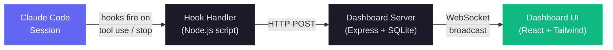
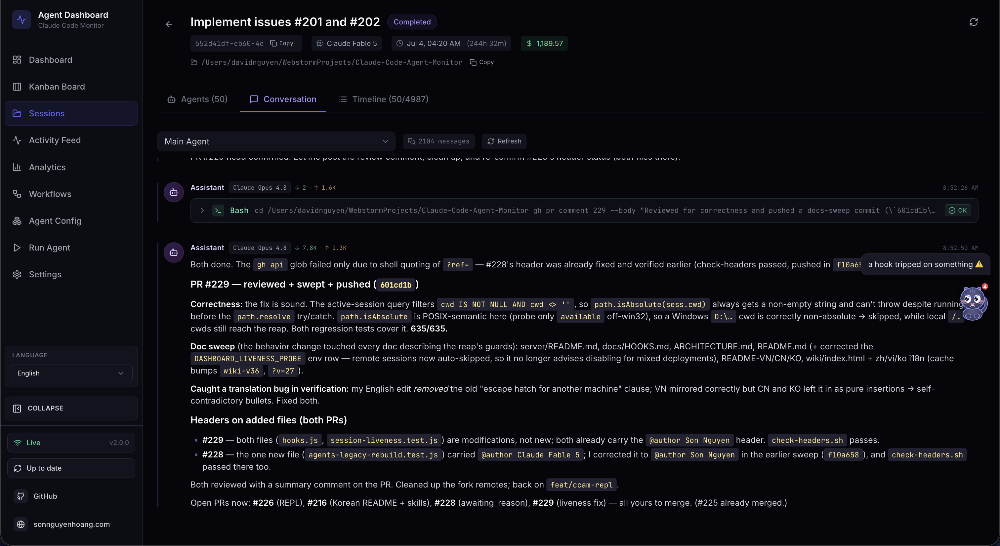
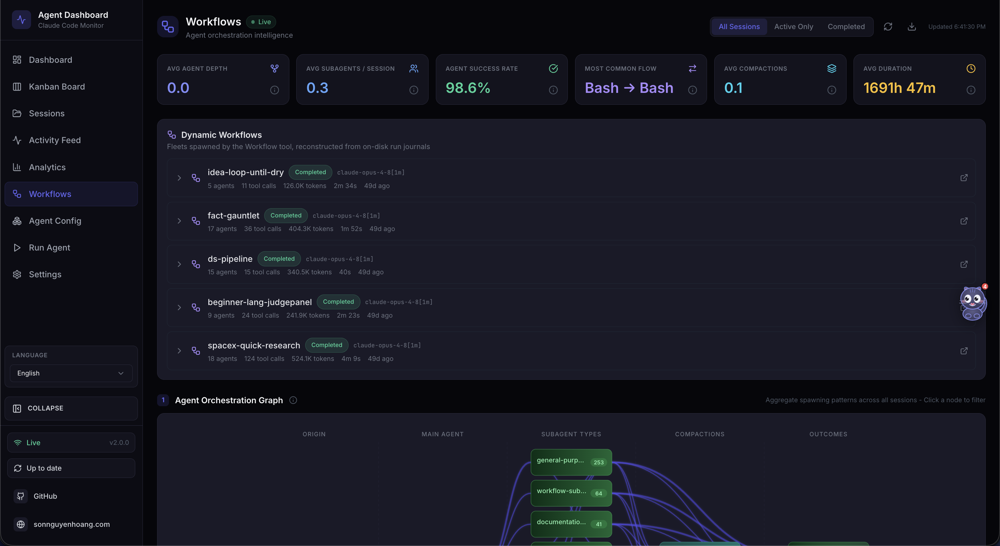
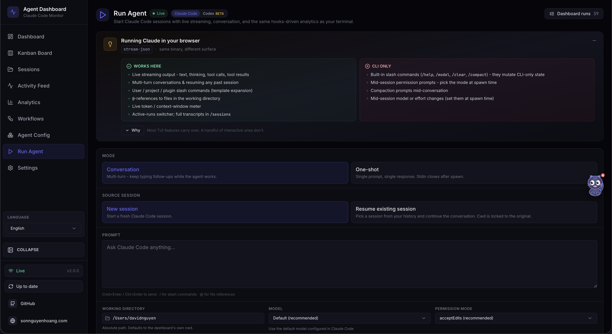
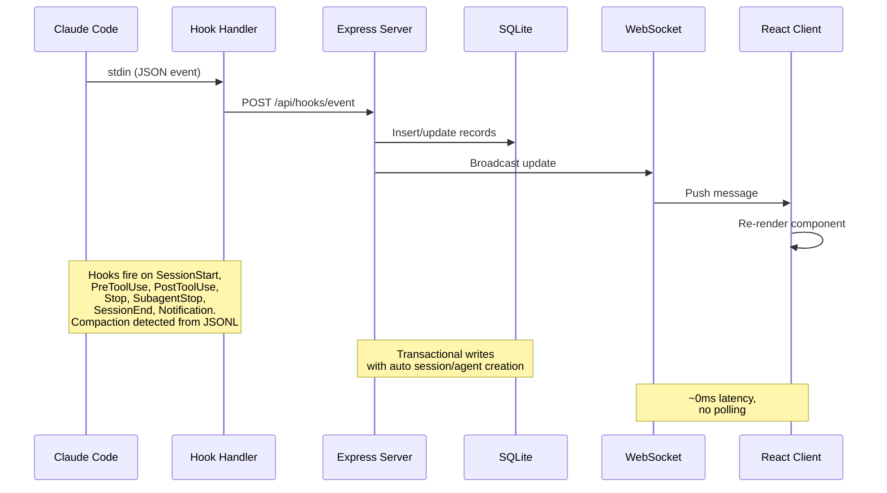
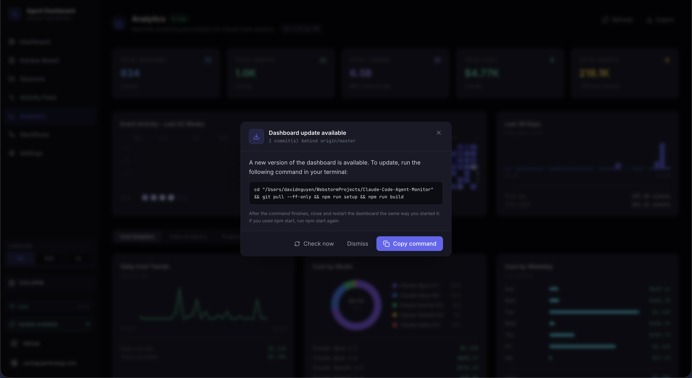
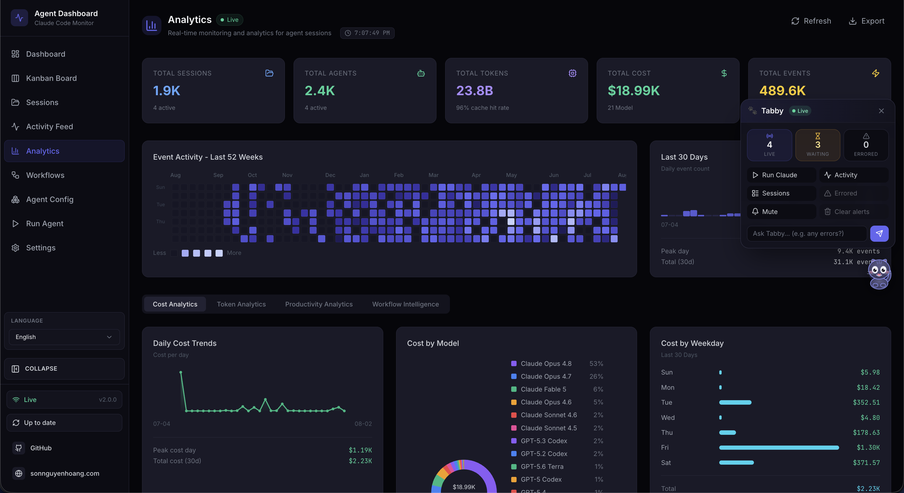
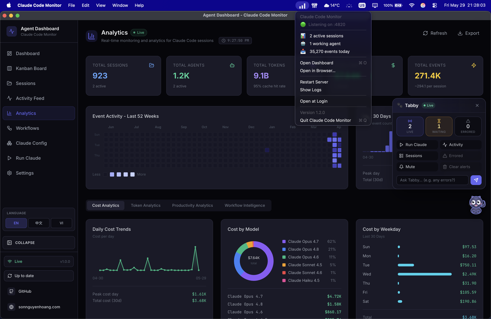

# Code Agent Monitor

### Real-time monitoring platform for code agent activity 🚀

A professional dashboard to track and visualize your code agent sessions, tool
usage, and subagent orchestration in real-time. Built with Node.js, Express,
React, and SQLite, it integrates directly with Claude Code and Codex via their
native hook systems for seamless session tracking and analytics.


<sub>Full stack detail (Express, Vite, TypeScript, Tailwind, Electron, VS Code,
Kubernetes/Terraform, Prometheus/Grafana, and more) is in
[ARCHITECTURE.md](./ARCHITECTURE.md).</sub>

> [!NOTE]
> Need task-first help? The
> [product wiki](https://buluma.github.io/Code-Agent-Monitor/wiki/) is the
> English product and architecture tour (GitHub Wiki is disabled for this
> repo); exact technical contracts stay in [`docs/`](./docs/README.md).

---

## Table of Contents

- [Overview](#overview)
- [Features](#features)
- [Quick Start](#quick-start)
- [How It Works](#how-it-works)
- [Configuration](#configuration)
- [`ccam` CLI](#ccam-cli)
- [npm Scripts](#npm-scripts)
- [Agent Extensions](#agent-extensions)
- [MCP Integration](#mcp-integration)
- [API Reference](#api-reference)
- [Hook Events](#hook-events)
- [Browser Notifications](#browser-notifications)
- [Update Notifier](#update-notifier)
- [Tabby — Floating Cat Companion](#tabby--floating-cat-companion)
- [Sound Cues](#sound-cues)
- [Connection Status Modal](#connection-status-modal)
- [VS Code Extension](#vs-code-extension)
- [Desktop App (macOS)](#desktop-app-macos)
- [Data Storage](#data-storage)
- [Plugin Marketplace](#plugin-marketplace)
- [Statusline](#statusline)
- [Server Architecture](#server-architecture)
- [Client Routing](#client-routing)
- [Hook Handler Flow](#hook-handler-flow)
- [Deployment Modes](#deployment-modes)
- [Project Structure](#project-structure)
- [Troubleshooting](#troubleshooting)
- [Contributing](#contributing)
- [License](#license)

---

## Overview

Track sessions, monitor agents in real-time, visualize tool usage, and observe
subagent orchestration through a professional dark-themed web interface.
Integrates directly with Claude Code & Codex via their native hook systems, and
mirrors Helm Code sessions read-only from their local state database.



In addition to the real-time monitoring dashboard, it also includes a local MCP
server implementation in `mcp/` that exposes a catalog of tools for
introspecting and managing the dashboard itself, making it easy to integrate
dashboard operations directly into your Claude Code & Codex workflows. There is
also an agent extension layer, which provides Claude Code & Codex plugins,
skills, and subagents for dashboard interaction, analytics, and workflow
intelligence.

The UI is English-only (`i18next` + `react-i18next` namespace resources —
architecture in [docs/I18N.md](./docs/I18N.md)).

### User Interface

Comes with a sleek dark theme, responsive design, and intuitive navigation to
explore your agent activity:

<p align="center">
  
  
</p>
<p align="center">
  
  
</p>
<p align="center">
  
  
</p>
<p align="center">
  
  
</p>

The sidebar gives quick access to Dashboard, Kanban Board, Sessions, Activity
Feed, Analytics, Workflows, Agent Config, Run, and Settings — each with
real-time updates. Full page-by-page tour, including Health, Task Progress,
Alerts/Webhooks, and Remote Data Sources, is in the
[product wiki](https://buluma.github.io/Code-Agent-Monitor/wiki/).

---

## Features

Full detail for every row below is in
[ARCHITECTURE.md → Feature Reference](./ARCHITECTURE.md#feature-reference).

> **Cursor sessions too (informational):** CCAM ingests whatever agent
> transcripts land under `~/.claude` — on this machine and on synced remotes.
> **Cursor** usage counts the same way: Cursor happens to store its agent
> sessions in those paths alongside Claude Code. CCAM does not distinguish which
> app wrote a file.

| Feature | Description |
| --- | --- |
|  **Task Progress**                     | Owner-attributed task tracking derived from observable provider state: current Claude `TaskCreate` / `TaskGet` / `TaskUpdate` / `TaskList` and lifecycle even… |
|  **Dashboard**                         | Two tabs persisted in `localStorage`: **Monitor** — overview stats (6 stat cards), active agent cards with collapsible subagent hierarchy, and recent activit… |
|  **Kanban Board**                      | Two views with a header toggle (persisted in `localStorage`): **Agents** — 4 columns (Working / Waiting / Completed / Error) — and **Sessions** — 5 columns (… |
|  **Sessions**                          | Searchable, filterable, **server-paginated** table of every recorded session. |
|  **Session Detail**                    | Per-session real-time overview panel with active-agent banner (current tool + task), six tile counters (events with events/min rate, tool calls, subagents, c… |
|  **Activity Feed**                     | Real-time streaming event log with pause/resume, multi-dimension filters (same toolbar as Session Detail plus a Session filter), server-driven "Load more" pa… |
|  **Analytics**                         | Token usage, tool frequency, activity heatmap (centered, day-of-week aligned starting Sunday, day-name tooltips), session trends, live/offline connection ind… |
|  **Live Updates**                      | WebSocket push -- no polling, instant UI updates |
|  **Auto-Discovery**                    | Sessions and agents are created automatically from provider signals. |
|  **History Import**                    | Provider-aware Import History brings in Claude Code transcripts from `~/.claude/` and Codex rollout JSONL from `~/.codex/sessions`. |
|  **Helm Code Monitor**                 | Provides read-only monitoring of Helm Code development sessions by mirroring the threads of <code>~/.helmcode/userdata/state.sqlite</code> (or a Settings ove… |
|  **Subagent Hierarchy**                | Collapsible parent-child agent tree on Dashboard and Session Detail. |
|  **Background Agents**                 | Correctly tracks backgrounded subagents without premature completion |
|  **Subagent Tool Attribution**         | Subagent-internal tool calls (Read, Bash, Edit, Grep, …) live only in per-subagent JSONL files — Claude Code emits no hooks for them. |
|  **Cost Tracking**                     | Per-model cost estimation with configurable pricing rules and per-session breakdowns. |
|  **Transcript Cache**                  | Real-time extraction from JSONL transcripts: tokens, compactions, API errors (`isApiErrorMessage` entries stored as `APIError` events), turn durations (store… |
|  **Notifications**                     | Full Web Push (VAPID) pipeline for reliable delivery. |
|  **Alerts**                            | Rules-based alerting engine — configured entirely in **Settings → Alerts & Notifications**, a tabbed **Rules / Channels / Activity** control center (no separ… |
|  **Update Notifier**                   | Server periodically runs a non-blocking `git fetch` and compares the local checkout to `origin/master`/`origin/main`/`origin/HEAD`. |
|  **Settings**                          | System info, hook status, model pricing management, notification preferences, data export **and restore** (the Import History panel's **Restore backup** mode… |
|  **Run Agent + Agent Config**          | `/run` begins with a Claude Code / Codex choice and keeps the provider toggle beside its Live status. |
|  **Codex Agent Config**                | The Codex half of Agent Config reads the full local account model catalog without the generic preview limit that could falsely show zero models, and always i… |
|  **MCP Server (Local)**                | Comprehensive local MCP server in `mcp/` with three transport modes (stdio, HTTP+SSE, interactive REPL) and 97 typed tools across 16 domain modules. |
|  **Workflows**                         | D3.js-powered visualization page with 11 interactive sections: agent orchestration DAG, tool execution Sankey diagram, collaboration network, subagent effect… |
|  **Compaction Tracking**               | Detects `/compact` events from JSONL transcripts, creates compaction agents and events. |
|  **Subsessions/Resumed Sessions**      | Automatically reactivates sessions when new events arrive, correctly handles `/resume` and orphaned sessions. |
|  **Pre-Existing Session Detection**    | Sessions already running when the server starts are imported as "active" (based on recent JSONL file modification). |
|  **Continuous Project Sync**           | The startup auto-import of `~/.claude/projects` is one-time (marker-gated), so a project folder created **after** first launch — whose sessions never flow th… |
|  **Remote Data Sources**               | Live remote / multi-machine Claude Code and Codex collection over SSH. |
|  **Responsive Design**                 | Mobile-friendly layouts with stacking grids, scrollable tables, and collapsible sidebar |
|  **UI Copy Coverage**                  | User-visible text runs through `i18next`/`react-i18next` namespace bundles (English only — see [docs/I18N.md](./docs/I18N.md)) rather tha… |
|  **Seed Data**                         | Built-in seed script for demos and development |
|  **Statusline**                        | Color-coded CLI statusline showing model, context usage, git branch, per-direction tokens, and session cost (USD) |
|  **Model Name Formatting**             | Human-friendly model names throughout the UI: raw identifiers like `claude-opus-4-7-20260101` or `claude-opus-4-7[1m]` display as "Claude Opus 4.7" or "Claud… |
|  **Claude + Codex Plugin Marketplace** | One 14-plugin source tree ships canonical Claude manifests, Codex `.codex-plugin/plugin.json` manifests, both marketplace catalogs, 66 bundled plugin skills,… |
|  **Run Claude**                        | Spawn `claude` subprocesses directly from the dashboard with a chat-style streaming UI. |
|  **Claude Config Explorer**            | A 12-tab inspector at `/cc-config` for everything Claude Code knows about: skills, subagents, slash commands, output styles, plugins (with per-plugin contrib… |
|  **Tabby**                             | A floating cat companion pinned to the bottom-right corner of every page. |
|  **Sound Cues**                        | Subtle audio feedback for live activity, **on by default** and fully opt-out. |
|  **Progressive Web App (PWA)**         | Three independent PWAs — dashboard, landing page, and wiki — each with its own Web App Manifest and Service Worker. |
|  **Desktop App (macOS)**               | Optional native desktop app built with Electron 35, living in the `desktop/` workspace alongside `client/`, `server/`, `mcp/`, and `vscode-extension/`. |
|  **Self-hosted assets (no CDN)**       | Every font and script is served locally, so the dashboard and docs make **zero third-party CDN requests** — they render fully offline and leak nothing to ext… |
|  **Session splash screen**             | A brief branding splash on app load (once per browser session): a **time-aware greeting** (Good morning / afternoon / evening / Working late), a bold tagline… |
|  **Command Palette**                   | Global `Cmd+K` / `Ctrl+K` jump-to overlay (`client/src/components/CommandPalette.tsx`), mounted once at the app root. |
|  **Terminal Focus**                    | A button on active-session cards raises the OS terminal window running that session (`POST /api/sessions/{id}/focus-terminal`, `server/lib/terminal-focus.js`). |
|  **Linear Ticket Linking**             | Read-only integration with [Linear](https://linear.app) (scoped to Linear only — no Jira, no GitHub Issues): link a dashboard session to a Linear issue by pa… |

> **Provider scope and homes:** Settings keeps the Claude Code / Codex / Both
> choice globally consistent, and lets you change either session-data home
> without restarting the dashboard.
>
> **Local safety boundaries:** Run Agent accepts any existing absolute working
> directory and canonicalizes it before use, so home and recent-project launches
> remain supported. Hosted webhook providers require HTTPS; generic and n8n
> targets may use HTTP for local/self-hosted receivers, and delivery never
> follows redirects.

---

## Quick Start

### Prerequisites

- **Node.js** >= 22.22.0 (24 LTS recommended)
- **npm** >= 9.0.0

### 1. Install

```bash
git clone https://github.com/buluma/Code-Agent-Monitor.git
cd Code-Agent-Monitor
npm run setup
```

### 2. Configure Claude Code Hooks

```bash
npm run install-hooks
```

Interactive multi-select for **Claude Code**, **Codex (beta)**, or both.
Codex rollouts and Helm Code sessions (mirrored read-only, no hooks) are
also auto-discovered. Full detail: [INSTALL.md](./INSTALL.md) and
[docs/HOOKS.md](./docs/HOOKS.md).

### 3. Start

```bash
# Development (hot reload on both server and client)
npm run dev

# Production (single process, built client)
npm run build && npm start
```

### 4. Open

| Mode        | URL                     |
| ----------- | ------------------------ |
| Development | `http://localhost:5173` |
| Production  | `http://localhost:4820` |

### 5. Optional: Run the local MCP server

```bash
npm run mcp:install && npm run mcp:build
ccam mcp stdio                 # stable launcher used by bundled plugins
```

See [mcp/README.md](./mcp/README.md) for host configuration, transports, and
the full tool catalog.

### Alternatives

- **Seed demo data:** `npm run seed`
- **Desktop app (macOS):** download from [Releases](https://github.com/buluma/Code-Agent-Monitor/releases/latest) or build with `npm run desktop:install && npm run desktop:dmg:arm64` — see [INSTALL.md → Desktop App](./INSTALL.md#desktop-app-macos-optional)
- **Docker / Podman:** `docker compose up -d --build` — see [INSTALL.md → Container mode](./INSTALL.md#container-mode-docker--podman) and [DEPLOYMENT.md](./DEPLOYMENT.md)

## How It Works



Full hook lifecycle, agent/session state machines, and cost calculation flow: [ARCHITECTURE.md](./ARCHITECTURE.md), [docs/HOOKS.md](./docs/HOOKS.md), and [docs/DATABASE.md](./docs/DATABASE.md).

## Configuration

> [!IMPORTANT]
> **Secure by default.** The server binds `127.0.0.1` and is **not** reachable from the network out of the box ([GHSA-gr74-4xfh-6jw9](./.github/SECURITY.md)). To expose it on a LAN, set **both** `DASHBOARD_HOST` (e.g. `0.0.0.0`) **and** `DASHBOARD_TOKEN`, and list your LAN hostnames in `DASHBOARD_ALLOWED_HOSTS`.

Full environment variable reference — ports, import limits, MCP, tokens, watchdog/liveness tuning, remote sync: [INSTALL.md → Environment variables](./INSTALL.md#environment-variables) and [.env.example](./.env.example).

The server periodically `git fetch`es `origin` and surfaces a modal with the exact upgrade command when you're behind — it never pulls or restarts itself.

## `ccam` CLI

The dashboard's full feature surface is also available from any terminal via the dependency-free **`ccam`** CLI (`bin/ccam.js`), linked automatically by `npm run setup`.

```bash
ccam status          # is the dashboard running?
ccam stats           # totals, today's events, status distributions
ccam tail            # live event feed in the terminal
```

Full command reference, discovery, and safety model: [docs/CLI.md](docs/CLI.md).

## npm Scripts

Full reference for every script (setup, dev, build, test, MCP, desktop, docker): [INSTALL.md → Scripts reference](./INSTALL.md#scripts-reference). Fastest local gate: `npm run verify`.

## Agent Extensions

A shared extension layer for Claude Code (`CLAUDE.md`, `.claude/rules/`, `.claude/skills/`, `.claude/agents/`) and Codex (`AGENTS.md`, `.codex/rules/`, `.codex/agents/`, `.codex/skills/`), plus distributable plugins under `plugins/` with both marketplace manifests.

Architecture diagram and layer breakdown: [ARCHITECTURE.md → Agent Extension Layer](./ARCHITECTURE.md#agent-extension-layer). Setup: [INSTALL.md → Agent extension packs](./INSTALL.md#optional-agent-extension-packs).

## MCP Integration

A local MCP server at `mcp/` with **97 typed tools** across 16 domain modules, exposing every supported dashboard action — scoped data reads, transcripts/images, pricing, workflows, alerts/webhooks, import/backup, Claude/Codex config, Run Agent, remote sources, settings, push, and guarded maintenance. Three transport modes: stdio, HTTP+SSE, and an interactive REPL.

```bash
npm run mcp:install && npm run mcp:build
ccam mcp stdio              # stable launcher used by bundled plugins
```

Architecture, tool catalog, safety model, transports, and configuration: [mcp/README.md](./mcp/README.md) — the canonical MCP doc.

## API Reference

Every route is documented by a single OpenAPI 3.0.3 spec (`server/openapi.js`), explorable three ways with the dashboard running (default port `4820`):

| Method | Path                             | Description                                             |
| ------ | ---------------------------------- | ----------------------------------------------------------- |
| `GET`  | `/api/docs`                      | Interactive **Swagger UI** — try-it-out request execution |
| `GET`  | `/api/redoc`                     | **ReDoc** reference — read-optimized three-panel view    |
| `GET`  | `/api/openapi.json`              | Raw OpenAPI 3.0.3 JSON spec                              |

A committed `openapi.yaml` at the repo root mirrors the live spec (regenerate with `npm run openapi:yaml`). Prometheus metrics are exposed at `GET /api/metrics`.

Full endpoint reference (sessions, agents, events, stats, analytics, hooks, pricing, workflows, settings, import history, cc-config, run, WebSocket protocol): [docs/API.md](docs/API.md).

## Hook Events

The dashboard processes 13 event types: 7 native Claude Code hooks (`SessionStart`, `UserPromptSubmit`, `PreToolUse`, `PostToolUse`, `Stop`, `SubagentStop`, `Notification`, `SessionEnd`) plus 5 synthesized from JSONL transcripts (`Compaction`, `APIError`, `TurnDuration`, `ToolError`, `Interrupted`).

Full per-hook reference — trigger, payload, and dashboard state transition: [docs/HOOKS.md](docs/HOOKS.md).

## Browser Notifications

Persistent browser notifications via Web Push (VAPID), delivered even when the tab is unfocused or the browser is backgrounded — configurable per event in Settings. The dashboard, landing page, and wiki each ship as independent installable PWAs with their own manifest and Service Worker.

Per-event defaults, VAPID pipeline, and PWA caching strategy: [ARCHITECTURE.md → Browser Notification System](./ARCHITECTURE.md#browser-notification-system).

## Update Notifier

Watches its own git checkout and surfaces a modal when the canonical branch is ahead of HEAD — branch- and fork-aware, with the exact command to run yourself. The server never pulls or restarts itself.

<p align="center">
  
</p>

Detection pipeline, payload shape, and failure modes: [ARCHITECTURE.md → Update Notifier Subsystem](./ARCHITECTURE.md#update-notifier-subsystem).

## Tabby — Floating Cat Companion

A floating cat companion pinned to the bottom-right corner, turning the live session stream into a reactive mascot with 8 moods, speech bubbles, and an Ask box that hands off to Run Claude for anything beyond a quick status lookup.

<p align="center">
  
</p>

Full mood table, panel, and accessibility detail: [ARCHITECTURE.md → Tabby Companion Subsystem](./ARCHITECTURE.md#tabby-companion-subsystem).

## Sound Cues

Subtle audio feedback for live session activity — on by default, one click to disable. Every cue is synthesized in the browser via the Web Audio API (no audio assets, no library). Guarded by a per-cue cooldown and a global burst budget so a flood of WebSocket events never becomes a flood of beeps.

Full cue table, synthesis details, and Settings behavior: [client/README.md → Audio cues](./client/README.md#audio-cues-libsoundts--hooksusesoundcuests).

## Connection Status Modal

Click the **Live** / **Disconnected** pill in the sidebar footer for WebSocket transport details: endpoint, uptime, throughput sparkline, top event types, and recent activity.

<p align="center">
  
</p>

Full detail: [client/README.md → Connection Status Modal](./client/README.md#connection-status-modal-componentssidebartsx).

## VS Code Extension

Monitor agent activity without leaving your editor: live sidebar, status bar pulse, and an embedded dashboard tab.

<p align="center">
  
</p>

Install: [INSTALL.md → VS Code extension](./INSTALL.md#optional-vs-code-extension). Architecture: [ARCHITECTURE.md → VS Code Extension Architecture](./ARCHITECTURE.md#vs-code-extension-architecture).

> [!TIP]
> Extension on VS Code Marketplace:
> [Code Agent Monitor](https://marketplace.visualstudio.com/items?itemName=buluma.claude-code-agent-monitor)

## Desktop App (macOS)

An optional native desktop app (Electron 35, in `desktop/`) — a macOS `.app`/`.dmg` that embeds the same dashboard with a tray icon, Open-at-Login, and a single-instance lock. Same UI, real OS window.

<p align="center">
  
</p>

Install, build, and runtime behavior (port adoption, data directory, logs): [INSTALL.md → Desktop App (macOS)](./INSTALL.md#desktop-app-macos-optional). Architecture: [ARCHITECTURE.md → Desktop App Architecture](./ARCHITECTURE.md#desktop-app-architecture-macos--electron). Contributor reference: [desktop/README.md](./desktop/README.md). Full user guide: [DESKTOP.md](./DESKTOP.md).

## Data Storage

SQLite 3 (`better-sqlite3` or `node:sqlite`), WAL mode, at `data/dashboard.db`. Delete that file to reset.

Full schema, ERD, and query reference: [docs/DATABASE.md](docs/DATABASE.md).

## Plugin Marketplace

CCAM ships **14 plugins** (66 skills, 18 subagents, 34 commands) from one shared source tree, installable for Claude Code, Codex, or via the skills.sh-compatible `skills` CLI.

```bash
# Claude Code
claude plugin marketplace add buluma/Code-Agent-Monitor
claude plugin install ccam-platform@claude-code-agent-monitor-plugins

# Codex
codex plugin marketplace add buluma/Code-Agent-Monitor
codex plugin add ccam-platform@claude-code-agent-monitor-plugins
```

Full catalog, `skills` CLI usage, and per-plugin breakdown: [docs/PLUGINS.md](docs/PLUGINS.md).

## Statusline

Standalone CLI statusline utility for Claude Code: model, user, cwd, git branch, context-window usage bar, token counts, and session cost, color-coded.

```
buluma@host ~/agent-dashboard/client | Sonnet 4.6 | main | ████████░░ 79% | 3↑ 2↓ 156586c | $0.4231
```

Segment reference and color thresholds: [ARCHITECTURE.md → Statusline Utility](./ARCHITECTURE.md#statusline-utility). Install: [statusline/README.md](statusline/README.md).

## Server Architecture

Full module dependency graph: [ARCHITECTURE.md → Server Architecture](./ARCHITECTURE.md#server-architecture) and [server/README.md](./server/README.md).

---

## Client Routing

Full route table and diagram: [client/README.md → Routing](./client/README.md#routing).

---

## Hook Handler Flow

stdin → parse JSON → POST /api/hooks/event → exit(0), with a 3s request timeout and a 5s safety-net fallback so a hung dashboard never blocks Claude Code. Full flowchart: [ARCHITECTURE.md → Hook Handler Design](./ARCHITECTURE.md#hook-handler-design).

---

## Deployment Modes

Development (2-process, HMR), production (1-process), desktop app, MCP sidecar, container, and cloud deployment modes are all covered in [ARCHITECTURE.md → Deployment Modes](./ARCHITECTURE.md#deployment-modes). For hands-on deploy commands, see [DEPLOYMENT.md](./DEPLOYMENT.md) and [INSTALL.md](./INSTALL.md).

---

## Project Structure

```
Code-Agent-Monitor/
├── server/            # Express API, hook ingestion, SQLite, WebSocket
├── client/            # React + Vite dashboard UI
├── mcp/               # Local MCP server (stdio / HTTP+SSE / REPL)
├── desktop/           # Electron desktop app (macOS)
├── vscode-extension/  # VS Code extension
├── scripts/           # Hook installer/handler, import, seed, cleanup
├── plugins/            # Claude Code + Codex plugin marketplace (14 plugins)
├── deployments/       # Docker/Podman, Helm, Kustomize, Terraform
├── docs/              # Canonical reference docs (API, hooks, DB, MCP, ...)
└── wiki/              # Static product wiki (GitHub Pages)
```

Full annotated tree, per-file responsibilities: [ARCHITECTURE.md → Project Structure](./ARCHITECTURE.md#project-structure).

## Troubleshooting

Full troubleshooting guide: [INSTALL.md](./INSTALL.md#troubleshooting).

---

## Contributing

Contributions are welcome — see
[`.github/CONTRIBUTING.md`](.github/CONTRIBUTING.md) for the full guide.

All contributors must sign the
[Contributor License Agreement](https://github.com/buluma/Code-Agent-Monitor/blob/master/CLA.md).
This is enforced automatically on every pull request by the `🖋️ CLA Assistant`
GitHub Action: the first time you open a PR, a bot asks you to sign by
commenting `I have read the CLA Document and I hereby sign the CLA`. The PR's
**CLA Assistant** status check stays red until you do, and signing once covers
all future contributions.

---

## License

MIT. See [LICENSE](LICENSE) for details.
