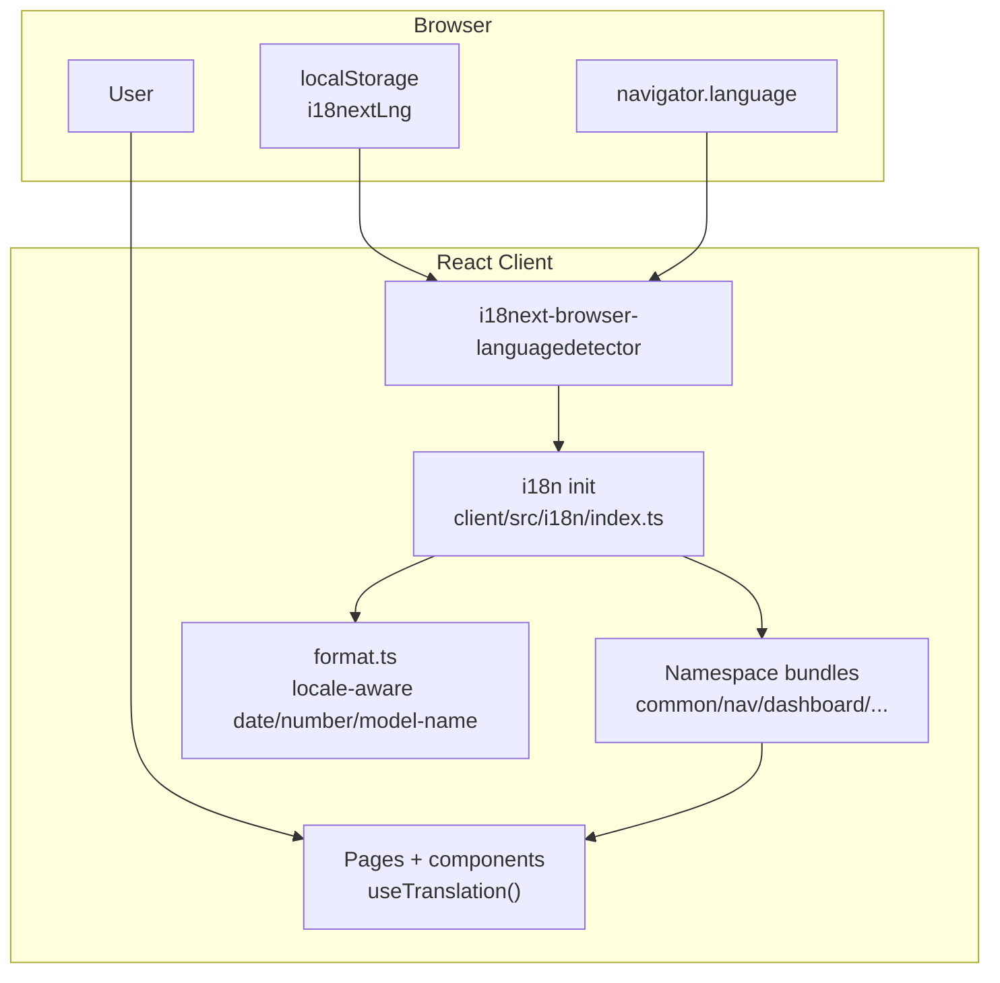
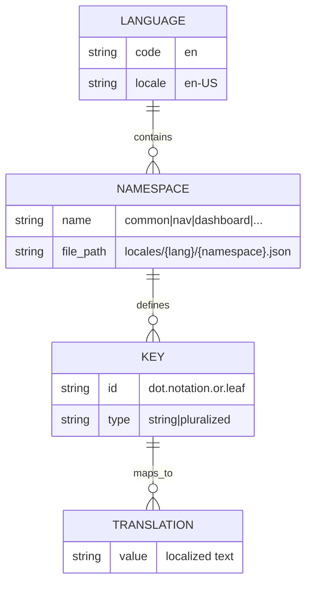
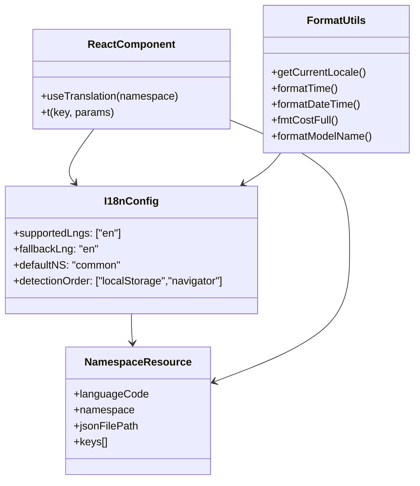
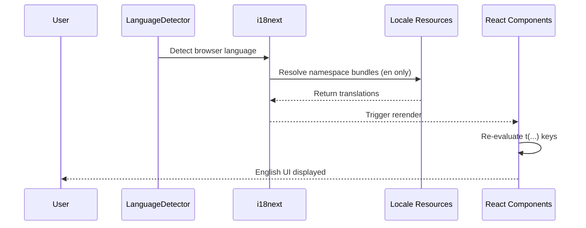
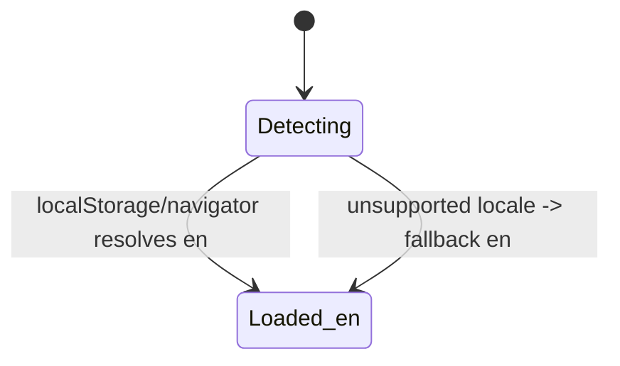
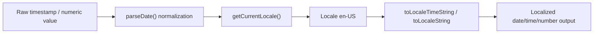

# Internationalization (i18n) Architecture and Usage

This guide documents how localization works in the Agent Dashboard, including
architecture, resources, runtime behavior, testing, and rollout.

**Supported language:** English (`en`) only

---

## 1) Architecture Overview

Localization is implemented in the frontend with `i18next` + `react-i18next` and
browser language detection.



**Key runtime facts**

- `supportedLngs`: `["en"]`
- `fallbackLng`: `"en"`
- `nonExplicitSupportedLngs`: `false`
- Detection order: `localStorage` → `navigator`

---

## 2) Resource and Namespace Strategy

Translation resources are stored per language and namespace:

- `client/src/i18n/locales/en/*.json`

Active namespaces:

- `common`
- `nav`
- `dashboard`
- `sessions`
- `activity`
- `analytics`
- `workflows`
- `settings`
- `kanban`
- `errors`



**Strategy notes**

- Keep namespace boundaries page/domain focused.
- Keep `en` namespace files complete and well-maintained.

### Translation quality checklist

When adding user-visible copy:

1. Write the English source string first, with enough context for developers to
   understand where it appears.
2. Preserve interpolation tokens, Markdown fragments, code identifiers, command
   names, and environment-variable names exactly as written.
3. Keep labels concise and test a narrow viewport, especially for headings,
   buttons, and table actions.

---

## 3) Key Naming Conventions

Use stable semantic keys, not English sentence literals.

### Convention rules

1. Use namespace-scoped keys: `namespace:key`
2. Use lower camelCase key segments
3. Keep terminology consistent across the application
4. Use suffixes for plurals when needed (e.g. `_plural`)
5. Group nested concepts by domain (e.g. `time.justNow`, `time.mAgo`)

### Examples

- `nav:dashboard`
- `common:time.justNow`
- `common:time.mAgo`
- `kanban:agentCount`
- `kanban:agentCount_plural`



---

## 4) Language Detection and Switching Flow

The dashboard detects the browser's language preference and loads the
appropriate locale bundle. Since only English is supported, the system always
resolves to `en`.





---

## 5) Date and Number Localization Behavior

Formatting utilities are centralized in `client/src/lib/format.ts`.

- `en` → `en-US`

`formatTime`, `formatDateTime`, and `fmtCostFull` use locale-aware `toLocale*`
APIs. Timestamp parsing normalizes timezone-less SQLite datetime strings to UTC
before display formatting.

`formatModelName` converts raw model identifiers (e.g.
`claude-opus-4-7-20260101`, `claude-opus-4-7[1m]`) into human-friendly display
names (e.g. "Claude Opus 4.7", "Claude Opus 4.7 (1M)"). This is
locale-independent (brand names are proper nouns) and is applied across all UI
surfaces except the Settings page (which shows raw patterns for pricing rule
configuration).



---

## 6) Testing Strategy

Use client tests to verify translation correctness, fallback behavior, and
locale formatting:

- `client/src/i18n/__tests__/i18n.test.ts`
- `client/src/lib/__tests__/format.test.ts`
- `client/src/components/__tests__/Sidebar.test.tsx`

Run:

```bash
npm run test:client
```

### Recommended test matrix

| Area                     | What to verify                           | Example                               |
| ------------------------ | ---------------------------------------- | ------------------------------------- |
| Resource completeness    | All keys present in `en` namespace files | Missing key detection in CI           |
| Terminology consistency  | Canonical terms stay stable              | `Agent`/`Subagent` expectations       |
| Date/number formatting   | Locale-specific output shape             | `en-US` formatting                    |
| Runtime locale detection | Browser language detection works         | Unsupported locale falls back to `en` |

---

## 7) Troubleshooting

| Symptom                        | Likely cause                           | Resolution                                                        |
| ------------------------------ | -------------------------------------- | ----------------------------------------------------------------- |
| Unexpected fallback to English | Unsupported locale code                | Ensure code normalizes to `en` and key exists in target namespace |
| Missing text on one page       | Namespace file key missing             | Add key to English namespace file                                 |
| Date/time looks wrong          | Locale mapping or timezone parse issue | Verify `getCurrentLocale()` and `parseDate()` behavior            |
| Inconsistent term usage        | Manual text drift                      | Enforce glossary and update locale tests                          |

---

## References

- `client/src/i18n/index.ts`
- `client/src/lib/format.ts`
- `client/src/i18n/__tests__/i18n.test.ts`
- `client/src/lib/__tests__/format.test.ts`
